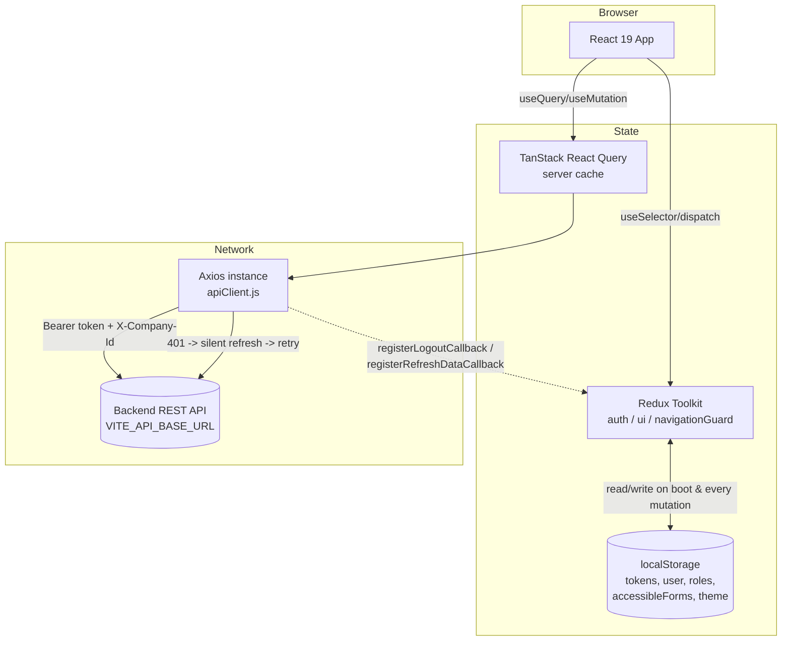
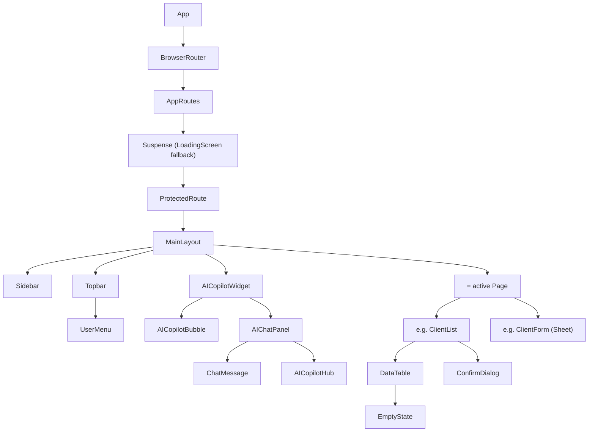
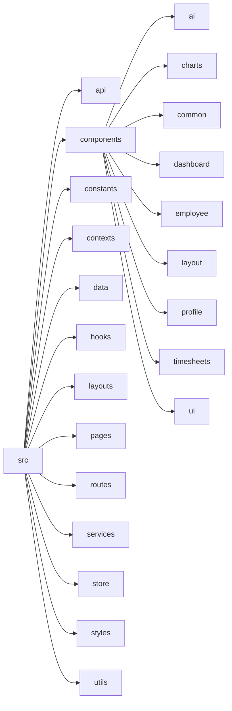
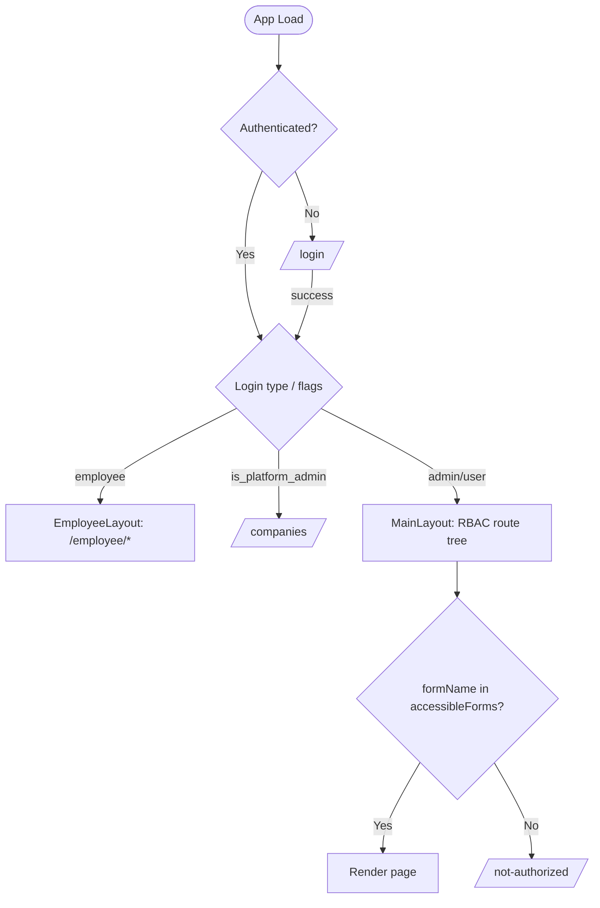
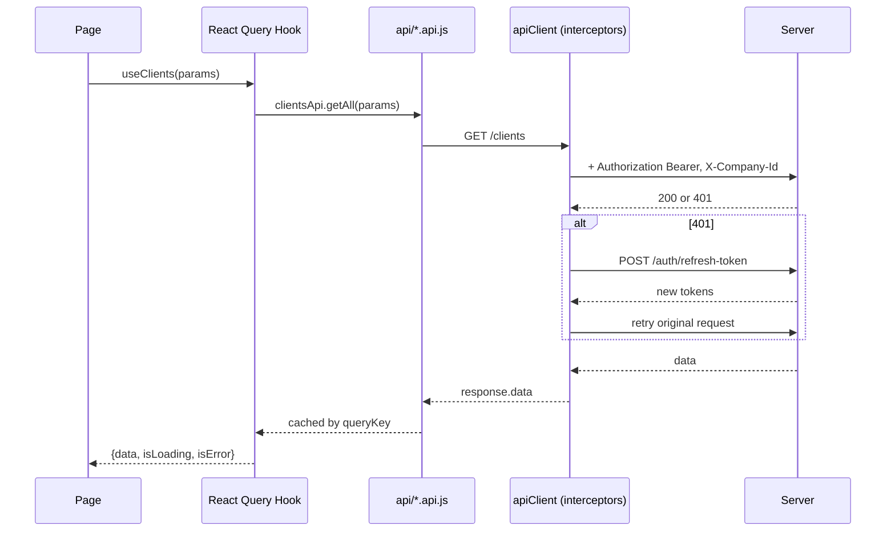
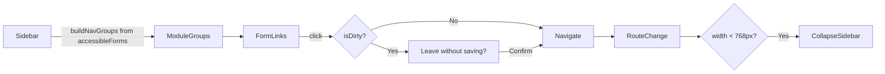
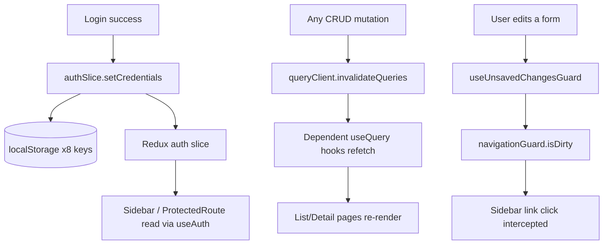

# Frontend Product Requirements Document
### Trackio — Resource Utilization Tracker (RUT Portal)

> Generated by static analysis of the frontend codebase at `frontend/` on the `pooja` branch. Every claim below is sourced from actual source files (paths and line references given where useful). Where the implementation is ambiguous, incomplete, or the intent isn't derivable from code, this document says **"Not identifiable from the current implementation."** No feature is invented or assumed.

---

## 1. Executive Summary

### Product Overview
Trackio (`VITE_APP_NAME=Trackio`, package name `rut-portal-frontend`, UI default title "Resource Utilization Tracker") is a single-page React application for tracking employee time, project/Service PO financials, and workforce utilization. It serves three distinct populations through separate layouts and route trees: **Company Admin / back-office users** (master-data management, timesheets, reports, AI insights), **Employees** (self-service time logging), and a **Platform Admin** (multi-tenant Company Management, a separate super-admin surface layered on top of the same app).

### Purpose
To replace manual timesheet/PO/cost tracking with a single system of record that: captures employee work logs, imports timesheets and monthly cost data in bulk, tracks Service PO (project) budgets and utilization, and surfaces analytics/AI-assisted insights to management (utilization %, bench risk, cost trends, forecasts).

### Frontend Objectives
- Provide role/permission-gated CRUD screens for every master entity (Clients, Companies, Employees, Users, Roles, Forms, Service Categories/Types, Service POs, Sub-Projects).
- Provide bulk Excel import pipelines for Employees, Clients, Service POs, Monthly Costs, and Timesheets, each with a preview/validation step before commit.
- Provide a rich analytics Dashboard and 5 dedicated Reports screens with fiscal-year/month filtering and Excel export.
- Provide an Employee self-service area for daily/monthly time logging against mapped Service POs.
- Provide an AI Copilot (floating chat widget + dedicated insight pages) layered over the whole authenticated app.
- Enforce RBAC end-to-end: sidebar navigation, route access, and field-level write permissions are all derived from the logged-in user's role→form mappings, not hardcoded per page.

### Target Users
- **Company Admin** — full back-office access, the only role that can see the "Administration" module (Users, Roles, Forms, Role↔Form / User↔Role mapping) and is exempt from most protected-account restrictions.
- **Other back-office roles** (HR, Finance/reporting roles, etc.) — scoped access per their Role's form mappings; permission level (`Read` vs `Read & Write`) is per-role, not per-form.
- **Employee** — a dynamically-provisioned login type (`loginType: 'employee'`) restricted to a 3-page self-service area (Dashboard, Timesheet, Reports); never sees the RBAC-driven sidebar.
- **Platform Admin** — a separate `is_platform_admin` flag (not a role), scoped only to Company Management; belongs to no company and has no roles.

### Key Features (implemented, verified in code)
- RBAC-driven navigation and route protection (`Sidebar.jsx`, `ProtectedRoute.jsx`)
- Master data CRUD: Clients, Companies, Employees, Users, Roles, Forms, Role↔Form mapping, User↔Role mapping, Service Categories, Service Types, Sub-Projects, Service POs
- Service PO lifecycle: resource allocation, timesheet-project mapping, utilisation tracking, closing
- Bulk Excel import: Clients, Employees, Service POs, Monthly Costs, Timesheets (each with its own validation/preview UX)
- Employee self-service time logging (Daily + Monthly modes) against mapped Service PO hierarchies
- Analytics Dashboard (Quarterly/Monthly) with ~24 chart/panel components
- 5 dedicated Reports screens with Excel export
- AI Copilot floating widget (chat) + 7 dedicated AI insight pages, backed by a real `/api/v1/ai/query` endpoint plus deterministic client-side computation for unsupported AI intents (forecasting, what-if, project health)
- Forgot-password (email → OTP → reset) and in-app change-password flows
- Light/Dark theme infrastructure (fully wired in Redux + Tailwind, but **no visible toggle control currently rendered** — see §13, §22)

---

## 2. Application Overview

### Overall UI
A classic **sidebar + topbar + content** admin shell (`MainLayout.jsx`) for back-office users, a visually near-identical but simplified shell (`EmployeeLayout.jsx`) for employees, and unstyled centered-card layouts for Auth/Forgot-Password screens. Forms across almost every CRUD module render as a right-side sliding **Sheet** (drawer) rather than a full page or center modal — the list page stays mounted behind it.

### Navigation Flow
1. Unauthenticated user hits any protected URL → redirected to `/login` (with the original destination preserved in router state for a post-login bounce-back).
2. On successful login, destination is resolved by identity: Employee → `/employee/dashboard`; Platform Admin → `/companies`; everyone else → the original `from` location or `/` (Dashboard).
3. Inside the app, the Sidebar is generated per-request from the user's own accessible-forms map (RBAC), not a static config — a role with zero mapped forms sees a "No modules assigned yet" Dashboard state.
4. Attempting to leave a page with unsaved changes (tracked via Redux `navigationGuard` slice) intercepts the Sidebar link click with a confirm dialog.
5. RBAC/route failures land on the shared `NotFound` component at `/not-authorized`, with copy generic enough to also cover true 404s.

### Layout Structure
| Layout | Used by | Sidebar | AI Copilot Widget |
|---|---|---|---|
| `AuthLayout` | `/login`, `/forgot-password/*` | none | none |
| `ForgotPasswordLayout` | nested inside AuthLayout for the 3 forgot-password screens | none | none |
| `MainLayout` | all admin/back-office routes | `Sidebar` (RBAC-driven, collapsible) | Yes (unless Platform Admin) |
| `EmployeeLayout` | `/employee/*` | `EmployeeSidebar` (static 3-item) | Yes |

Both authenticated layouts share the same structural shell: sidebar + `Topbar` + scrollable `<main>` + a shared footer ("© {year} GTT Data Solutions Ltd…").

### User Experience
- Toast notifications (`react-hot-toast`) for every mutation's success/failure, styled via CSS variables so they auto-adapt to theme.
- Skeleton loaders throughout (list tables, forms, KPI tiles) rather than spinners, except one full-screen `LoadingScreen` spinner used for route-level Suspense fallback and RBAC-loading gates.
- Framer Motion used for fade/slide-in on cards, KPI tiles, table rows, and the AI Copilot bubble/panel.
- No app-wide error boundary exists (see §15, §22) — a render-time exception in a page is not caught anywhere above the page itself.

---

## 3. Frontend Architecture

### Folder Structure (see §19 for full detail)
```
frontend/src/
├── api/          # one file per resource, thin axios wrappers, no business logic
├── components/   # ai/, charts/, common/, dashboard/, employee/, layout/, profile/, timesheets/, ui/, auth/
├── constants/     # routes, query keys, RBAC form map, protected accounts, AI suggested questions
├── contexts/      # ThemeContext (thin Redux wrapper), ForgotPasswordContext (local flow state)
├── data/          # (present in tree; not analyzed in this pass — no files were read from it)
├── hooks/         # one file per resource (React Query), plus cross-cutting hooks
├── layouts/        # AuthLayout, EmployeeLayout, ForgotPasswordLayout, MainLayout
├── pages/          # one folder per module, mirrors the route tree
├── routes/         # index.jsx (route table), ProtectedRoute.jsx
├── services/       # apiClient.js (axios instance, interceptors, token storage)
├── store/          # Redux Toolkit store + 3 slices
├── styles/         # index.css (Tailwind layers, CSS variable theme tokens)
└── utils/          # cn, formatters, validators, authErrors, download, aiCopilotEngine
```

### Routing Architecture
React Router v6 (`BrowserRouter`), every route/page component is `React.lazy`-loaded, wrapped in a single app-wide `<Suspense fallback={<LoadingScreen/>}>` (`routes/index.jsx`). No per-route Suspense boundaries and no React error boundary exist alongside it. See §5 for the full route table and §23 for the routing diagram.

### Component Architecture
- **Pages** (`src/pages/**`) own data-fetching (via hooks) and compose feature components.
- **Feature components** (`components/charts`, `components/employee`, `components/timesheets`, `components/ai`, `components/dashboard`) are page-specific, not reused across modules.
- **Common components** (`components/common/*`) — `DataTable`, `ConfirmDialog`, `EmptyState`, `StatusBadge`, `PageHeader`, `LoadingScreen`, `StatCard` — are the only true cross-module reusable widgets outside the `ui/` primitive layer.
- **UI primitives** (`components/ui/*`) — a shadcn/ui set (Radix + CVA + Tailwind), see §8.

### State Management
Three-tier model:
1. **Redux Toolkit** (`store/`) — `auth`, `ui` (theme + sidebar collapse + global loading), `navigationGuard` (unsaved-changes flag). Auth and theme both mirror themselves into `localStorage` by hand (no `redux-persist`).
2. **TanStack React Query** — all server data (list/detail/mutations) across every module; see §6/§11.
3. **Local component state / react-hook-form** — form field state, in-page filters, UI toggles.

### API Layer
A single Axios instance (`services/apiClient.js`) with request/response interceptors handling auth headers, silent token refresh, and centralized logout — every `api/*.api.js` file is a thin wrapper with no retry/caching logic of its own (that lives in the React Query hook layer). See §10.

### Theme System
Redux-backed (`uiSlice.theme`), persisted to `localStorage['rut_theme']`, applied via a `dark` class on `<html>` (Tailwind `darkMode: 'class'`). Fully wired end-to-end but **the only UI control that called `toggleTheme` (in `Topbar.jsx`) is commented out** — there is currently no in-app way for a user to switch themes. See §13.

### Design System
shadcn/ui: Radix UI primitives + `class-variance-authority` for variants + `clsx`/`tailwind-merge` (`cn()`) for class composition, confirmed via `components.json` (`style: "default"`, `baseColor: "slate"`, `cssVariables: true`, `tsx: false`). Full semantic color/spacing/typography token set lives in `tailwind.config.js` + `src/styles/index.css` (see §8).

### Reusable Components
See §8 for the full `components/ui/*` inventory and §6 for `components/common/*`.

### Architecture Diagram


---

## 4. Technology Stack

| Category | Technology | Version | Notes |
|---|---|---|---|
| UI Library | React | 19.0.0 | with `react-dom` 19.0.0 |
| Build Tool | Vite | 6.0.5 | `@vitejs/plugin-react`, alias `@`→`./src`, manual chunk splitting (vendor/redux/query/charts/motion/radix) |
| Package Manager | npm | — | `package-lock.json` present at repo root and per-package |
| Router | React Router DOM | 6.28.0 | `BrowserRouter`, no data-router APIs (no `useBlocker`) |
| Global State | Redux Toolkit + React Redux | 2.4.0 / 9.2.0 | 3 slices: auth, ui, navigationGuard |
| Server State | TanStack React Query (+ Devtools) | 5.62.0 | Global 5min staleTime / 10min gcTime default |
| Table | TanStack React Table | 8.21.3 | Powers `DataTable.jsx`, manual pagination/filtering |
| Styling | Tailwind CSS + tailwindcss-animate | 3.4.17 | `darkMode: 'class'`, CSS-variable token system |
| UI Component Library | shadcn/ui (Radix UI primitives) | Radix ^1.x/^2.x pkgs | accordion, alert-dialog, avatar, checkbox, dialog, dropdown-menu, label, popover, progress, scroll-area, select, separator, slot, switch, tabs, tooltip |
| Variant Engine | class-variance-authority + clsx + tailwind-merge | 0.7.1 / 2.1.1 / 2.5.5 | `cn()` helper |
| Form Library | React Hook Form + @hookform/resolvers | 7.54.0 / 3.9.0 | paired with Zod resolver everywhere |
| Validation Library | Zod | 3.24.0 | schemas colocated in each form + shared `utils/validators.js` |
| HTTP Client | Axios | 1.7.9 | single instance, interceptor-based refresh |
| Charts | Recharts | 2.13.0 | all 24 chart components in `components/charts/` |
| Icons | lucide-react | 0.468.0 | used throughout |
| Command menu | cmdk | 1.0.4 | backs `components/ui/command.jsx` |
| Date Library | Day.js (+ relativeTime, localizedFormat plugins) | 1.11.13 | all formatting in `utils/formatters.js` |
| Animation | Framer Motion | 11.14.0 | cards, tables, AI widget |
| Notifications | react-hot-toast | 2.4.1 | global `<Toaster>` in `main.jsx` |
| Excel | xlsx (SheetJS) | 0.18.5 | import parsing + export generation, client-side |
| PDF | jsPDF + jspdf-autotable | 4.2.1 / 5.0.8 | used at least in Employee list export |
| File Upload UI | react-dropzone | 14.3.5 | all import flows (Client/Employee/ServicePO/MonthlyCost/Timesheet) |
| Linting | ESLint 9 + eslint-plugin-react-hooks/react-refresh | ^9.0.0 | **script exists in package.json but no flat-config file (`eslint.config.js`) was found — lint is currently non-functional as configured** |

---

## 5. Route Documentation

All paths from `src/constants/routes.js`, resolved in `src/routes/index.jsx`. Every route component is lazy-loaded inside one global `<Suspense>`.

| Route | Page Component | Layout | Auth Required | Additional Gate | Key Components Used |
|---|---|---|---|---|---|
| `/login` | `Login` | AuthLayout | No (redirects away if already logged in) | — | `AccountTypeDialog` |
| `/forgot-password` | `ForgotPasswordEmail` | AuthLayout›ForgotPasswordLayout | No | — | `AccountTypeDialog` |
| `/forgot-password/verify-otp` | `ForgotPasswordOtp` | AuthLayout›ForgotPasswordLayout | No | redirects to email step if context missing | `useCountdownTo` |
| `/forgot-password/reset-password` | `ForgotPasswordReset` | AuthLayout›ForgotPasswordLayout | No | redirects to email step if context missing | password policy checklist |
| `/` | `Dashboard` | MainLayout | Yes | none beyond base auth | ~24 chart components |
| `/ai-insights` | `AIInsights` | MainLayout | Yes | `formName: AI_INSIGHTS` | `InsightCard` |
| `/employees`, `/employees/new`, `/employees/:id/edit` | `EmployeeList` / `EmployeeForm` | MainLayout | Yes | `formName: EMPLOYEES` | `DataTable`, export dropdown |
| `/employees/:id/ai-profile` | `EmployeeAIProfile` | MainLayout | Yes | none (auth-only) | `useAIQuery` |
| `/users`, `/users/new`, `/users/:id/edit` | `UserList` / `UserForm` | MainLayout | Yes | `formName: USERS` | protected-account guards |
| `/roles`, `/roles/new`, `/roles/:id/edit` | `RoleList` / `RoleForm` | MainLayout | Yes | `formName: ROLES` | — |
| `/roles/:roleId/forms` | `RoleFormMappingForm` | MainLayout | Yes | `formName: ROLE_FORM_MAPPING` | checkbox matrix |
| `/forms`, `/forms/new`, `/forms/:id/edit` | `FormList` / `FormForm` | MainLayout | Yes | `formName: FORMS` | — |
| `/user-role-mapping`, `/user-role-mapping/:userId/edit` | `UserRoleMappingList` / `Form` | MainLayout | Yes | `formName: USER_ROLE_MAPPING` | checkbox matrix |
| `/companies`, `/companies/new`, `/companies/:id/edit` | `CompanyList` / `CompanyForm` | MainLayout | Yes | `platformAdminOnly` | — |
| `/clients`, `/clients/new`, `/clients/:id/edit` | `ClientList` / `ClientForm` | MainLayout | Yes | `formName: CLIENTS` | import/export |
| `/service-pos`, `/new`, `/:id/edit` | `ServicePOList` / `ServicePOForm` | MainLayout | Yes | `formName: SERVICE_POS` | import/export |
| `/service-pos/import` | `ServicePOImport` | MainLayout | Yes | `formName: SERVICE_POS` | `react-dropzone` |
| `/service-pos/:id` | `ServicePODetail` | MainLayout | Yes | `formName: SERVICE_POS` | allocation, mapping tables |
| `/sub-projects`, `/new`, `/:id/edit` | `SubProjectList` / `Form` | MainLayout | Yes | `formName: SUB_PROJECTS` | — |
| `/service-types`, `/new`, `/:id/edit` | `ServiceTypeList` / `Form` | MainLayout | Yes | `formName: SERVICE_TYPES` | export |
| `/service-categories`, `/new`, `/:id/edit` | `ServiceCategoryList` / `Form` | MainLayout | Yes | `formName: SERVICE_CATEGORIES` | — |
| `/timesheets` | `TimesheetList` | MainLayout | Yes | `formName: TIMESHEETS` | `SyncWorkLogsDialog` |
| `/timesheets/upload` | `TimesheetUpload` | MainLayout | Yes | `formName: TIMESHEETS` | `ImportPreviewPanel` |
| `/timesheets/import/:id` | `TimesheetImportDetail` | MainLayout | Yes | `formName: TIMESHEETS` | editable grid |
| `/monthly-costs` | `MonthlyCostList` | MainLayout | Yes | `formName: MONTHLY_COSTS` | grouped summary |
| `/monthly-costs/import` | `MonthlyCostImport` | MainLayout | Yes | `formName: MONTHLY_COSTS` | client-side parse preview |
| `/monthly-costs/:month/:year`, `/new`, `/:id/edit` | `MonthlyCostDetail` / `Form` | MainLayout | Yes | `formName: MONTHLY_COSTS` | — |
| `/reports/*` (5 sub-routes, see §13) | `ReportsLayout` + 5 pages | MainLayout | Yes | per-report `formName` | charts + `DataTable` |
| `/ai/root-cause`, `/ai/executive-report`, `/ai/forecast`, `/ai/recommendations`, `/ai/what-if`, `/ai/project-health` | 6 AI pages | MainLayout | Yes | none (auth-only; no RBAC form rows exist yet) | `useAIQuery` |
| `/notifications` | `Notifications` | MainLayout | Yes | none | placeholder only, see §22 |
| `/not-authorized` | `NotFound` | none | — | — | shared 404/403 component |
| `/employee/dashboard` | `EmployeeDashboard` | EmployeeLayout | Yes, `employeeOnly` | — | calendar strip |
| `/employee/timesheet` | `EmployeeTimesheet` | EmployeeLayout | Yes, `employeeOnly` | — | `TimesheetCalendar`, `WorkLogEntryTable` |
| `/employee/reports` | `EmployeeReports` | EmployeeLayout | Yes, `employeeOnly` | — | Daily/Monthly/Range toggle |
| `*` | `NotFound` | none | — | — | catch-all |

**Cross-cutting redirects** (`MainLayout.jsx`, apply to the entire admin route group): an Employee-type login is always bounced to `/employee/dashboard`; a Platform Admin is always bounced to `/companies` unless already there.

---

## 6. Module Documentation

Each module below follows the same List + Form (Sheet) pattern unless noted.

### 6.1 Clients (`pages/clients/`)
- **Purpose**: master list of client organizations, referenced by Service POs.
- **Features**: search, Active/Inactive filter, sort, server pagination, Excel export (full dataset, re-fetched), sample-template download, Excel import (preview-then-confirm), Edit/Delete (write-gated).
- **Validation**: `client_name` required (1–100 chars), `industry` optional (≤100 chars), `status` enum.
- **Business rules**: none beyond field length; delete is a hard action with a warning dialog.
- **API**: `GET/POST/PUT/DELETE /clients`, `GET /clients/active/list`, `POST /clients/import`.
- **Reusables**: `DataTable`, `ConfirmDialog`, `StatusBadge`, `PageHeader`.

### 6.2 Companies (`pages/companies/`) — Platform Admin only
- **Purpose**: multi-tenant company bootstrap/management; each company creation seeds its first admin account.
- **Features**: search, sort, pagination, Activate/Deactivate toggle (no hard delete — companies are never deleted from the UI).
- **Validation (create)**: `company_code` (1–50), `company_name` (1–100), `admin_email` (valid email), `admin_password` (≥8 chars). **Validation (edit)**: only `company_name` + `status` — code/admin fields are immutable after creation per backend contract.
- **Business rules**: `X-Company-Id` header is never attached to these calls (Platform Admin belongs to no company).
- **API**: `GET/POST /companies`, `PATCH /companies/:id`.

### 6.3 Employees (`pages/employees/`)
- **Purpose**: workforce master, the anchor entity for cost, timesheets, and Service PO allocation.
- **Features**: search (≥3 chars before firing), Active/Inactive filter, inline status `Switch`, Reset Password dialog, Excel/PDF/Print export, sample download, Excel import.
- **Validation**: `employee_code` (2–20, `^[A-Z0-9_-]+$`, auto-uppercased), `full_name` (2–100), `email_id` (valid email), `designation` optional, `total_experience`/`company_experience` (0–60, nullable), `date_of_joining` required, `date_of_leaving` optional, `resource_description` (≤2000), `password` (create-only, optional).
- **Business rules**: `company_experience` is **read-only and auto-computed** from `date_of_joining` (days elapsed ÷ 365.25); Employee ID is immutable after creation; delete is soft (sets inactive) — dialog copy explicitly states this.
- **API**: `GET/POST/PUT/DELETE /employees`, `GET /employees/active/list`, `PUT /employees/:id/reset-password`, `POST /employees/import`.

### 6.4 Roles (`pages/roles/`)
- **Purpose**: RBAC role master; drives both permission level and (via mapping) accessible forms.
- **Features**: search, Active/Inactive filter, "Manage Forms" action (separately grantable, gated by `useHasForm(ROLE_FORM_MAPPING)`, not just role write-access).
- **Validation**: `role_name` (2–100), `permission` enum (`Read` / `Read & Write`), `is_original_data_visible` boolean, `status` enum.
- **Business rules**: delete is blocked server-side if the role is still assigned to any user (client shows a warning, doesn't pre-check); on save, the current session's own accessible-forms and original-data-visibility are proactively refreshed so a self-edit takes effect immediately, not on next login.
- **API**: `GET/POST/PUT /roles`, `DELETE /roles/:id` (hard delete, no soft-delete flag).

### 6.5 Role↔Form Mapping (`pages/roleFormMapping/`)
- **Purpose**: per-role checklist of which Forms (screens) are accessible — the actual RBAC data source consumed by Sidebar/ProtectedRoute.
- **Features**: grouped-by-module checkbox matrix with "Select All" tri-state per group; Administration-module forms are always excluded from the checklist (a role can never self-grant RBAC-management access).
- **Business rule / API quirk**: the mapping-fetch endpoint returns every mapping row ever created including soft-unmapped ones (`status:false`) — the UI must filter to `status===true` on load.
- **API**: `GET /roles/form-mappings/:roleId`, `PUT /roles/form-mappings/:roleId` (full replace).

### 6.6 Service Categories (`pages/serviceCategories/`)
- **Purpose**: top-level classification (e.g. "Billable") that Service Types roll up into; the category literally named "Billable" is what makes a Service PO billable.
- **Validation**: `name` (2–100), `status` enum.
- **Note**: this module's pagination is client-side slicing over an already-fetched page rather than pure server pagination (inconsistent with most other modules — see §22).

### 6.7 Service Types (`pages/serviceTypes/`)
- **Purpose**: sub-classification under a Service Category, selected on every Service PO.
- **Filter**: dependent Category dropdown (only module whose list filter is a dependent select rather than a segmented control).
- **Validation**: `service_type_name` (2–100), `service_category_id` (required, coerced positive number).
- Same client-side-pagination note as Service Categories.

### 6.8 Sub-Projects (`pages/subProjects/`)
- **Purpose**: optional child breakdown under a Service PO (used in timesheet hierarchy).
- **Filters**: dependent Service PO select + Active/Inactive.
- **Validation**: `sub_project_name` (1–150), `service_po_id` required, `description` (≤1000), `end_date ≥ start_date` (zod `.refine`), `status` enum.
- **Business rule**: delete sets inactive; warning that it may be referenced by timesheets.

### 6.9 Users (`pages/users/`)
- **Purpose**: back-office login accounts, distinct from Employees (a User may optionally link to one Employee record).
- **Features**: search by email, Status + Role filters, protected-account lockouts (see §12), inline status toggle.
- **Validation (create)**: `email` valid, `password` (≥8, upper+lower+digit+special via 4 chained regexes — duplicated inline rather than reusing the shared `passwordPolicySchema`, see §22), `confirmPassword` must match, `role_ids` min 1, `employee_id` optional positive int. **Validation (edit)**: same minus password fields.
- **Business rules**: `isProtectedAccount()` (role name `Company Admin`) blocks edit/delete/role-change everywhere, enforced redundantly at list-UI and form level (direct-URL safety net).
- **API**: `GET/POST/PUT/DELETE /users`.

### 6.10 User↔Role Mapping (`pages/userRoleMapping/`)
- **Purpose**: assign one or more Roles to a User (separate screen from User's own role_ids field on create — this is the ongoing management surface).
- **Business rule**: same protected-account block, same soft-removed-row filtering quirk as Role↔Form Mapping.
- **API**: `GET /roles/user-mappings/:userId`, `PUT /roles/user-mappings/:userId` (full replace).

### 6.11 Forms — RBAC Form Master (`pages/forms/`)
- **Purpose**: the catalog of screens/capabilities that Roles can be mapped to (**not** a form-builder — "Form" here means "a protectable screen/module entry").
- **Validation**: `module_name` (2–100), `form_name` (2–100), `status` enum.
- **Business rule**: deleting a form sets it inactive and cascades out of every role's accessible-forms (warning shown, not pre-checked).

### 6.12 Service POs (`pages/servicePOs/`)
- **Purpose**: the core "project" entity — budget, dates, billing classification, and the anchor for resource allocation, sub-projects, and timesheet hours.
- **List**: filters by Client/Category/Type/PO/Status, Excel export (full dataset), sample + import.
- **Form**: `service_po_name` (3–200), `client_id`, `service_type_id`, `po_value` optional >0, `start_date`/`end_date` (end ≥ start), `expected_man_hours` optional, `account_manager` (1–100), `service_description` (1–1000), `invoice_frequency` enum, `invoice_amount` ≥0, `status` enum. **Computed field**: `is_billable` is derived on submit from whether the selected Category is named "Billable" — not a user-facing input.
- **Detail page** (`ServicePODetail.jsx`): utilisation card (logged vs expected hours), Allocated Resources table (add/remove employees), separate Timesheet Project Mapping table (controls what appears in an employee's timesheet project dropdown — a distinct concept from allocation), Close PO action (one-way, only while active).
- **Import**: single-step (no client-side preview) — `.xlsx`/`.csv` ≤10MB uploaded directly; all-or-nothing (any invalid row aborts the whole import); result screen shows per-row errors.
- **API**: full CRUD + `/close`, `/allocate`, `/resources/:employeeId` (deallocate), `/utilisation`, `/import`.

### 6.13 Monthly Costs (`pages/monthlyCosts/`)
- **Purpose**: per-employee-per-month salary/ops/billable cost records, aggregated into a period summary list.
- **List** (`MonthlyCostList.jsx`): a **grouped-by-period summary**, not raw records — one row per month/year with employee count and cost totals; row click drills into `MonthlyCostDetail` for that period's individual records; bulk period-delete supported.
- **Detail** (`MonthlyCostDetail.jsx`): individual employee records for a fixed month/year, with search, sort, pagination, add/edit/delete.
- **Form**: `employee_id` (locked on edit), `month`/`year`, `salary_cost` ≥0 required, `ops_cost`/`billable_cost` ≥0 optional ("leave blank to use system default").
- **Import**: the only import flow with **full client-side parsing** (SheetJS `sheet_to_json`), tolerant column-name aliasing, flexible month/year parsing (Excel serial dates, "Jan 2025", "01/2025", etc.), client-side row validation and de-duplication, and an **Import button disabled until every row is valid**.
- **Note**: a "Calculate for month" feature exists in hooks/API (`POST /monthly-costs/calculate`) but its UI trigger is currently commented out — see §22.
- **API**: full CRUD + bulk delete, `getIdsForPeriod` (paginated ID collection for period-bulk-delete), `/calculate`, `/import`.

### 6.14 Timesheets (`pages/timesheets/`)
- **Purpose**: the official, published record of hours worked, populated either by Excel upload or by "syncing" employee self-service work-log drafts.
- **List** (`TimesheetList.jsx`): an **import-history list** (one row per uploaded batch), not raw entries; Month/Year filter; row click prefetches and opens `TimesheetImportDetail`.
- **Upload flow** (`TimesheetUpload.jsx`): 2-step (Upload → Preview/Confirm). Client-side de-dupes rows within the workbook before upload (rewrites the file in-memory if duplicates found). Preview comes from the backend (`POST /timesheets/upload`), rendered via shared `ImportPreviewPanel`; confirming calls `POST /timesheets/confirm/:importId`.
- **Sync flow** (`SyncWorkLogsDialog.jsx`): pulls pending employee work-log drafts for a chosen month through the *same* preview→confirm pipeline as file upload (`POST /timesheets/sync-employee-worklogs`).
- **Import Detail** (`TimesheetImportDetail.jsx`): editable grid — only "Modified Hours" is editable (original Hours is read-only); bulk save via one transactional PUT; Publish is one-way (locks new rows, keeps Modified Hours editable); Add Record dialog for manual rows pre-publish; custom unsaved-changes guard (beforeunload + popstate, since the app uses plain `BrowserRouter` without `useBlocker`); client-side pagination over a fully-fetched row set (chosen to avoid per-row-animation lag on large imports).
- **API**: `GET/POST/DELETE /timesheets`, `/upload`, `/confirm/:id`, `/import/history`, `/import/:id`, `/import/:id/rows`, `/import/:id/hours` (bulk), `/import/:id/publish`, `/sync-employee-worklogs`.

---

## 7. Screen Documentation

Given the module count (~90 page components), full per-screen buttons/forms/tables/dialogs detail is folded into §6 (Module Documentation) and §8/§9 (Component/Form Documentation) rather than repeated per screen. Distinct UI mechanics not already covered:

- **Layout shells**: all forms render as a right-side `Sheet` (widths range `max-w-sm` for Service Category to `max-w-4xl` for Employee), not full pages or center dialogs.
- **Filters**: every List screen uses a collapsible "Filters" panel (badge shows active-filter count) rather than always-visible filter bars.
- **Search**: consistently a single debounced (400ms) text box; Employee/User require ≥3 typed characters before the search param fires.
- **Sorting**: server-side single-column sort via `DataTable`'s TanStack integration, except Service Category/Service Type which slice an already-fetched page client-side.
- **Pagination**: server-driven (`meta.total/current_page/per_page`) almost everywhere; page-size selector offers 10/20/50/100.
- **Responsive behaviour**: Sidebar auto-collapses below 768px on every route change; no other responsive breakpoints were confirmed in this pass beyond Tailwind's default utility classes in use — **not exhaustively verified across every screen; treat as "Not fully identifiable from the current implementation."**
- **Accessibility**: see §17 — concentrated in Radix-derived `ui/` primitives; explicit ARIA in page-level custom markup is sparse.

---

## 8. Component Documentation

### 8.1 Common components (`components/common/`)
| Component | Purpose | Key Props |
|---|---|---|
| `DataTable.jsx` | TanStack-Table-powered list grid; server-driven pagination/filtering by default | `columns`, `data`, `isLoading`, `pagination{page,limit,total}`, `onPageChange`, `onPageSizeChange`, `sorting`/`onSortingChange`, `emptyState`, `toolbar`, `onRowClick` |
| `ConfirmDialog.jsx` | Generic confirm/destructive-action modal | `open`, `onOpenChange`, `title`, `description`, `confirmLabel`, `cancelLabel`, `variant` (default `destructive`), `onConfirm`, `isLoading` |
| `EmptyState.jsx` | Empty-list placeholder | `icon` (default `Inbox`), `title`, `description`, `action{label,onClick,icon,variant}` |
| `StatusBadge.jsx` | Colored status pill | `status` (mapped via `getStatusColor`), `label` override |
| `PageHeader.jsx` | Title + description + right-aligned actions row | `title`, `description`, `actions`, `children` |
| `LoadingScreen.jsx` | Full-screen spinner (Suspense/RBAC-loading fallback) | `className` |
| `StatCard.jsx` | Dashboard KPI tile with trend arrow, gradient theme, tooltip on truncated values | `title`, `value`, `icon`, `trend`, `trendLabel`, `description`, `gradient` (blue/green/amber/orange/red/purple/cyan), `isLoading` |

### 8.2 UI primitives (`components/ui/`) — shadcn/ui, Radix-based

| File | Purpose | Notable props/variants |
|---|---|---|
| `alert.jsx` | Inline alert box, `role="alert"` | variant: default/destructive |
| `avatar.jsx` | Circular avatar w/ fallback initials | Radix Avatar wrapper |
| `badge.jsx` | Small status/label pill | variant: default/secondary/destructive/success/warning/info/outline |
| `button.jsx` | Base button, CVA variants | variant: default/destructive/outline/secondary/ghost/link; size: default/sm/lg/icon |
| `card.jsx` | Card container + Header/Title/Description/Content/Footer | — |
| `checkbox.jsx` | Radix checkbox | checked/indeterminate |
| `command.jsx` | Command-palette list (cmdk) | used inside `searchable-select`/`multi-select` |
| `dialog.jsx` | Radix modal dialog primitives | Content/Header/Footer/Title/Description |
| `dropdown-menu.jsx` | Radix dropdown menu | used by UserMenu, row actions |
| `form.jsx` | react-hook-form + Radix Label glue (`FormField`/`FormItem`/`FormControl`/`FormMessage`) | wires `aria-describedby`/`aria-invalid` |
| `input.jsx` | Base text input | — |
| `label.jsx` | Radix label | — |
| `multi-select.jsx` | Checkbox-list multi-select w/ chips | `aria-expanded`, `aria-label` |
| `popover.jsx` | Radix popover | used by pickers, filters |
| `progress.jsx` | Radix progress bar | used in utilisation/health scores |
| `scroll-area.jsx` | Radix custom scrollbar container | — |
| `searchable-select.jsx` | Single-select combobox with search | keyboard nav, used pervasively for entity pickers |
| `select.jsx` | Radix select (native-like dropdown) | guarded against spurious empty `onValueChange` on mount (see §22) |
| `separator.jsx` | Divider line | — |
| `sheet.jsx` | Radix Dialog-based slide-over panel | side: right (used for all CRUD forms) |
| `skeleton.jsx` | Pulsing placeholder block | — |
| `switch.jsx` | Radix toggle switch | used for status toggles, boolean flags |
| `table.jsx` | Base table primitives (+ `[role=checkbox]` styling) | — |
| `tabs.jsx` | Radix tabs | used in AIChatPanel, EmployeeTimesheet |
| `textarea.jsx` | Base multiline input | — |
| `tooltip.jsx` | Radix tooltip, global `TooltipProvider delayDuration=300` in `main.jsx` | — |
| `date-range-picker.jsx` | Two-click start/end date range popover | `value{startDate,endDate}`, `clearable` |
| `fiscal-year-picker.jsx` | FY (`FY 2024–25`) picker, paginated 6-per-page year grid | `value`, `onChange` |
| `month-year-picker.jsx` | Month grid + year nav popover | `value{month,year}`, `clearable` |

### 8.3 AI components (`components/ai/`)
`AICopilotWidget` (FAB + bubble + panel container, mounted in both authenticated layouts), `AICopilotBubble` (proactive digest teaser), `AIChatPanel` (chat/hub view container), `AICopilotHub` (grid launcher to the 7 AI pages), `ChatMessage` (message bubble w/ typewriter reveal, priority accent bar, copy/regenerate), `MarkdownLite` (hand-rolled markdown renderer, no dependency), `PriorityBadge`, `SuggestedQuestions`, `TypingDots`, `AIPageHeader` (shared header for the 7 AI insight pages — not independently detailed by name in research but present in file tree).

### 8.4 Chart components (`components/charts/`) — all Recharts-based
24 components, each rendering one analytics view for Dashboard/Reports (bar/line/donut/composed/table/matrix). Full list and one-line description of each is in §13 (Charts).

### 8.5 Employee components (`components/employee/`)
`ProjectSelect` (searchable Service-PO picker scoped to the employee's own mapped projects, hierarchically indented), `TimesheetCalendar` (month grid, 5-state day coloring), `WorkLogEntryModal` (react-hook-form+zod single-entry modal — **currently unrendered/dead code**, kept for its exported constants), `WorkLogEntryTable` (collapsible Service-PO tree with hour steppers).

### 8.6 Layout components (`components/layout/`)
`Sidebar` (RBAC-driven nav, collapsible, unsaved-changes guard), `EmployeeSidebar` (static 3-item nav), `Topbar` (sidebar toggle, static title, UserMenu — no search, no breadcrumbs, dead theme-toggle code), `UserMenu` (avatar dropdown: Change Password, Sign out), `NotificationPanel` (fully built bell/popover with 30s polling — **confirmed orphaned, not rendered anywhere**, see §22).

---

## 9. Form Documentation

All forms use React Hook Form + Zod (`@hookform/resolvers/zod`). Full field-by-field validation is documented per-module in §6; consolidated cross-cutting patterns:

- **Submission flow**: on submit, most forms strip empty-string/null optional fields before calling the mutation; on success, a toast fires and the page navigates back to the module's list route (closing the Sheet); on failure, `extractApiError(err)` renders a toast and the Sheet stays open with the entered data intact.
- **Field-level error mapping**: 422 responses are mapped onto the correct RHF field via `applyFieldErrors` (`utils/authErrors.js`), which uses `extractFieldErrors` from `apiClient.js`; any field error with no matching visible input is returned as `leftover` and shown as a toast/banner instead.
- **Loading state**: every "edit" form shows a local skeleton (3–5 pulsing bars) while the record + related dropdown data load, before mounting the actual `useForm`-bound content.
- **Special cases**:
  - **Login** (`pages/auth/Login.jsx`): email + password; ambiguous accounts trigger `AccountTypeDialog` (User vs Employee) before resubmitting.
  - **Forgot Password** (3 screens): email → OTP (6-digit, 5-min validity, 60s resend cooldown, lockout after max attempts) → reset (password policy checklist + confirm match); state carried via `ForgotPasswordContext` (in-memory only, cleared on unmount).
  - **Change Password** (`ChangePasswordDialog.jsx`): no "current password" field (identity comes from the Bearer token) — new + confirm password only, submit disabled until every policy rule passes.
  - **Employee Reset Password**: separate dialog from the Employee form itself; only path to (re)set an employee's password post-creation.
  - **User create/edit**: two distinct Zod schemas (create requires password+confirm+role_ids; edit omits password entirely, driven through the separate User↔Role Mapping screen or the create-time array).
  - **Company create/edit**: two distinct Zod schemas (create bootstraps an admin account; edit only allows name/status).

---

## 10. API Integration

Single Axios instance (`services/apiClient.js`); every `api/*.api.js` file returns `.then(r => r.data)` (or `.data?.data`) with no per-file retry/cache logic — that's delegated entirely to the React Query hook layer (§11).

### 10.1 Cross-cutting behavior
| Aspect | Behavior |
|---|---|
| Auth header | `Authorization: Bearer <accessToken>` attached on every request from `localStorage['rut_access_token']` |
| Multi-tenancy header | `X-Company-Id` attached when a company is present on the session (currently always null/no-op — no backend tenant support yet, per code comments) |
| 401 handling | Response interceptor queues concurrent failed requests, calls `POST /auth/refresh-token` via a plain (non-interceptor) axios instance to avoid loops, replays queued requests on success |
| Refresh failure | Full logout: clears all 8 localStorage auth keys, invokes a registered `logoutCallback` (wired in `main.jsx` to dispatch Redux logout + hard-redirect to `/login`) |
| Retry policy (queries) | React Query default: no retry on 4xx, up to 2 retries otherwise |
| Retry policy (mutations) | 0 retries |
| File responses | Report endpoints support `format=json|excel|csv|pdf`; non-JSON responses are fetched as `blob` and paired with a filename parsed from `Content-Disposition` |

### 10.2 Endpoint inventory (by resource)

| Resource (file) | Method & Path | Purpose |
|---|---|---|
| auth.api.js | POST /auth/login, /auth/logout, /auth/forgot-password, /auth/verify-otp, /auth/resend-otp, /auth/reset-password, /auth/refresh-token; PUT /auth/change-password | Full auth lifecycle |
| clients.api.js | GET/POST/PUT/DELETE /clients, GET /clients/active/list, POST /clients/import | Client master CRUD + import |
| companies.api.js | GET/POST /companies, GET /companies/:id, PATCH /companies/:id | Tenant/company management |
| dashboard.api.js | GET /dashboard/stats, /employee-billable-breakdown, /top-employees-by-po, /analytics, /analytics2 | Dashboard data |
| employeeProjects.api.js | GET /employee-timesheets/projects | Employee's mapped project list |
| employeeReports.api.js | GET /employee-reports/daily, /monthly, /range | Employee's own reports (json/excel/csv/pdf) |
| employeeServicePOMapping.api.js | POST/DELETE /employee-servicepo-mapping, PUT .../:id/activate, /deactivate, GET .../employee/:id, .../service-po/:id | Admin-side timesheet-project mapping |
| employeeWorkLog.api.js | GET /employee-timesheets/calendar, /daily, /monthly-summary, /monthly; POST/PUT/DELETE .../entries, /monthly | Employee self-service work log (draft) |
| employees.api.js | GET/POST/PUT/DELETE /employees, GET /employees/active/list, PUT .../reset-password, POST /employees/import | Employee master CRUD |
| forms.api.js | GET/POST/PUT/DELETE /forms | RBAC form-master CRUD |
| monthlyCosts.api.js | GET/POST/PUT/DELETE /monthly-costs, DELETE bulk, POST /calculate, POST /import | Monthly cost CRUD + import |
| reports.api.js | GET /reports/monthly-cost-summary, /resource-allocation, /service-po-summary, /monthly-resource-utilization, /resource-project-utilization-report, /client-service-po-hours | Reports data |
| roles.api.js | GET/POST/PUT/DELETE /roles, POST /roles/forms (accessible + checklist variants), GET/POST/PUT/DELETE /roles/user-mappings/*, GET/PUT /roles/form-mappings/:roleId | Role CRUD + both RBAC mapping tables |
| serviceCategories.api.js | GET/POST/PUT/DELETE /service-categories | Service Category CRUD |
| servicePOs.api.js | GET/POST/PUT/DELETE /service-pos, /active/list, /:id/close, /:id/allocate, /:id/resources/:employeeId, /:id/utilisation, /import | Service PO full lifecycle |
| serviceTypes.api.js | GET/POST/PUT/DELETE /service-types | Service Type CRUD |
| subProjects.api.js | GET/POST/PUT/DELETE /sub-projects, /by-po/:poId | Sub-Project CRUD |
| timesheets.api.js | GET/POST/DELETE /timesheets, /upload, /confirm/:id, /import/history, /import/:id, /import/:id/rows, /import/:id/hours, /import/:id/publish, /sync-employee-worklogs | Timesheet import lifecycle |
| users.api.js | GET/POST/PUT/DELETE /users | User CRUD |
| aiCopilot.api.js | POST /ai/query | Conversational + one-shot AI queries |
| aiInsights.api.js | GET /ai-insights/ | Scheduled AI insight feed |

---

## 11. State Management

### 11.1 Redux Toolkit (`store/`)
| Slice | State shape | Persistence |
|---|---|---|
| `auth` | `user, accessToken, refreshToken, isAuthenticated, roles, accessibleForms, accessibleFormsLoaded, isOriginalDataVisible, company, loginType` | Every mutating reducer writes through to 8 fixed `localStorage` keys; initial state hydrates directly from those keys at boot |
| `ui` | `sidebarCollapsed, theme, globalLoading` | `theme` persisted to `localStorage['rut_theme']`; `sidebarCollapsed`/`globalLoading` are session-only |
| `navigationGuard` | `isDirty, message` | Not persisted — purely in-memory, reset on every route mount/unmount via `useUnsavedChangesGuard` |

No `redux-persist` — persistence is manual, per-reducer. Serializable-check middleware explicitly ignores `auth/setCredentials` and `auth/setTokens` actions.

### 11.2 React Query (server state, all modules)
- **Global defaults** (`main.jsx`): `staleTime: 5min`, `gcTime: 10min`, `retry`: skip on 4xx else ≤2, `refetchOnWindowFocus: false`, mutation `retry: 0`.
- **Query keys**: centralized in `constants/queryKeys.js` as a `QUERY_KEYS` factory object (functions for parameterized keys) — used consistently by nearly every hook, with a few modules (`useServiceTypes.js`) using inline array keys instead (minor inconsistency).
- **Caching**: list queries use `placeholderData: prev => prev` to avoid layout flicker on pagination/filter changes; "active list" queries (`useActiveClients`, `useActiveEmployees`, etc.) use a longer 10-minute `staleTime` since they back dropdowns that change rarely.
- **Mutations**: every create/update/delete invalidates the relevant list (and detail, where applicable) query key on success; several modules (Monthly Costs) also cross-invalidate a related Reports query key.
- **Devtools**: `@tanstack/react-query-devtools` is a dependency; mount point for it was not confirmed in the files read — **not identifiable from the current implementation whether it's actually rendered in dev builds.**

### 11.3 Context API
`ThemeContext` — thin wrapper exposing Redux theme state/actions as a hook-friendly API (`useTheme()`), applies the `dark` class to `<html>` via `useEffect`. `ForgotPasswordContext` — local (non-persisted) state machine for the 3-screen forgot-password flow (email, loginType, otp, expiry timestamps).

### 11.4 Local/form state
React Hook Form owns all form field state; most list pages keep filters/search/pagination in local `useState`, synced into query params passed to the relevant `useX(params)` hook.

---

## 12. Authentication Flow

### Login
Fields: email, password. Zod-validated (`emailSchema` + non-empty password). Submits to `POST /auth/login`; an ambiguous account (both a User and an Employee record share credentials) returns `requiresUserTypeSelection`, prompting `AccountTypeDialog` before resubmission with the chosen `loginType`. On success: tokens + user/roles/company are written to Redux (which mirrors to `localStorage`), accessible-forms are optimistically set from the login response then re-fetched authoritatively in the background, and the user is redirected based on identity (Employee → employee dashboard; Platform Admin → Company Management; else → original destination or Dashboard).

### Token Storage
`localStorage`, fixed keys: `rut_access_token`, `rut_refresh_token`, `rut_user`, `rut_roles`, `rut_accessible_forms`, `rut_original_data_visible`, `rut_company`, `rut_login_type`. Redux `authSlice` is a cache mirroring these keys, hydrated on boot.

### Protected Routes
`ProtectedRoute.jsx` supports 4 independent, combinable gates selected per-route via props: base `isAuthenticated` check (→ `/login`), `employeeOnly` (→ Dashboard if not an employee login), `platformAdminOnly` (→ `/not-authorized`), `allowedRoles` (defined but unused in the current route table), and `formName` (RBAC — flattens the accessible-forms map and checks the named form is present; shows `LoadingScreen` instead of a false-negative redirect while the forms fetch is in flight).

### Logout
Explicit (UserMenu "Sign out": `authApi.logout()` → local Redux `logout()` → navigate to `/login`) or implicit (silent-refresh failure in `apiClient.js` → `handleLogout()`). Both clear all 8 localStorage keys and reset the `auth` slice.

### Session Handling
No idle-timer/inactivity auto-logout was found — sessions persist until token refresh fails or the user explicitly logs out. `isOriginalDataVisible` is set once at login from the roles snapshot and does **not** auto-refresh mid-session (a Role Master edit takes effect on next login, except when the acting user edits their own currently-active role, which proactively refreshes both accessible-forms and original-data-visibility for the current session).

### Permission Handling
Two independent permission axes: **role-based write permission** (`useCanWrite()` — `Read` vs `Read & Write` per role, OR'd across all of a user's roles) and **form-based access** (`useHasForm()` / the `formName` route gate — whether a form appears anywhere in the accessible-forms map). A third flag, `is_original_data_visible`, independently gates the Modified/Original data toggle in Dashboard and Reports. `isProtectedAccount()` (role name `Company Admin`) is a fully separate, hardcoded client-side rule blocking destructive/role-changing actions on specific accounts regardless of the acting user's own permissions.

---

## 13. UI/UX Features

### Navigation
RBAC-driven `Sidebar` for back-office users (module grouping, fixed display order overriding the API's alphabetical order, a hardcoded `'Administration'` module restricted to Company Admins, Platform Admins see a completely different single-item nav). Static 3-item `EmployeeSidebar` for employees, entirely unaffected by RBAC.

### Sidebar
Collapsible (260px ↔ 64px, animated), auto-collapses under 768px on every route change, intercepts navigation when unsaved changes exist (Redux `navigationGuard`).

### Header (Topbar)
Sidebar-toggle button + static app title (a `title` prop exists but no caller passes one) + `UserMenu`. **No search bar, no breadcrumbs.** A theme-toggle button exists in code but is fully commented out.

### Breadcrumbs
Not implemented anywhere in the app — **not identifiable / confirmed absent.**

### Cards
`StatCard` (KPI tiles, 7 gradient themes), `Card`/`CardHeader`/etc. (shadcn primitive) used throughout Dashboard, Reports, AI pages, and detail screens.

### Charts (Recharts, `components/charts/`)
| Component | Type | Data |
|---|---|---|
| BillableAnalyticsPanel | Stacked bar + donut + table (view toggle) | Billable/Non-Billable/Customer-NB hours per employee |
| BillableByClientChart | Horizontal bar | Top clients by billable hours |
| ClientCategoryCostMatrix | Stacked progress bars | Cost split by category per client |
| ClientCostChart | Horizontal bar | Total cost per client |
| ClientPOMatrixChart | Expandable bars | Hours per client, drilled into per-PO |
| ClientWiseAnalyticsTable | Table + inline bar | Hours/cost/avg-rate/% per client |
| CostByTypeDonut | Donut | Cost by service category |
| CostTrendChart | Stacked bar | Monthly cost by category |
| CustomerNonBillableChart | Horizontal bar | Non-billable hours per client |
| EmployeeBenchChart | Progress-bar list | Bench % per employee, tiered |
| EmployeeBillableBreakdown | Table | Billable %, top projects, NB reasons per employee |
| HoursByClientChart | Horizontal bar | Total hours per client |
| HoursByEmployeeChart | Horizontal bar | Billable hours per employee |
| LeaveHoursTrendChart | Line | Monthly leave hours |
| MonthlyHoursTrendChart | Stacked bar | Monthly hours by category (FY/quarter) |
| MonthlyUtilizationTrendChart | Line | Monthly overall utilization % |
| NoWorkTrendChart | Line | Monthly "no work logged" hours |
| NonBillableBreakdownChart | Donut | NB hours by reason (**appears unused by current Dashboard**) |
| NonBillableTrendChart | Composed (bar+line) | Billable/NB hours + % line (**appears unused — legacy**) |
| ProjectWiseAnalyticsTable | Table, sticky cols | Cost per project per month by category |
| ResourceInsightPanel | Composite list+pie | Bench watchlist, mix, sole-contributor PO risk |
| TopClientsByCostPanel | Ranked progress list | Top clients by cost |
| TopEmployeesByPOPanel | Card grid | Contributor hours per Service PO |
| TopPOsChart | Vertical bar | Top 5 POs by all-time hours |
| WorkforceDonutChart | Donut | Active vs inactive employee count |

### Dialogs
`ConfirmDialog` (generic confirm/destructive), `AccountTypeDialog` (login ambiguity), `ChangePasswordDialog`, `SyncWorkLogsDialog`, `WorkLogEntryModal` (unrendered), plus the `Sheet` drawer pattern used for every CRUD form.

### Notifications (toasts)
`react-hot-toast`, global `<Toaster>` (top-right, 4s duration, themed via CSS variables) driven through `useNotification()` (`success/error/info/warning/loading/promise`).

### Skeleton Loaders
`Skeleton` primitive + custom `FormSkeleton` per form + `DataTable`'s 6-row skeleton + `StatCard`'s loading layout + `.skeleton` CSS utility class (shimmer alternative).

### Empty States
`EmptyState` common component, used as `DataTable`'s default when a filtered/searched list returns zero rows.

### Error Pages
Single shared `NotFound` component serves both the true `*` catch-all 404 and the `/not-authorized` RBAC-denial redirect target, with copy generic enough to cover both ("doesn't exist or you don't have permission").

### Theme
Fully implemented (Redux state, localStorage persistence, Tailwind `dark:` class toggling, full CSS-variable light/dark token sets) but **no visible control to switch it** — flagged as a gap in §22.

### Responsive Design
Sidebar collapse breakpoint (768px) is the only confirmed responsive behavior in this pass; Tailwind's utility-class responsive modifiers are used ad hoc throughout components but a full per-breakpoint audit was not performed — **not exhaustively verified.**

### Dark Mode
See Theme above — infrastructure exists, UI trigger does not currently exist.

---

## 14. Validation Rules

All validation is Zod-based via `@hookform/resolvers/zod`. Shared schemas live in `utils/validators.js`; module-specific schemas are colocated in each Form component (see §6/§9 for full per-field rules). Consolidated shared rules:

| Schema | Rule |
|---|---|
| `emailSchema` | required, valid email format |
| `otpSchema` | exactly 6 digits, `^\d{6}$` |
| `passwordSchema` | min 8 chars (baseline-only, used where an exact backend policy isn't fully confirmed) |
| `PASSWORD_POLICY_RULES` | live-checklist rule set: ≥8 chars, 1 uppercase, 1 lowercase, 1 digit, 1 special char |
| `passwordPolicySchema` | full policy `.refine()` over all 5 `PASSWORD_POLICY_RULES` |

**Known duplication** (flagged, not fixed): `UserForm.jsx`'s create-mode password schema re-declares the same 5 rules inline via separate `.regex()` calls instead of importing `passwordPolicySchema` — two sources of truth for the identical policy.

**Date validation**: cross-field `end_date ≥ start_date` enforced via zod `.refine()` on Service PO, Sub-Project, and (implicitly) Service PO Summary's date-range filter.

**Number validation**: coercion + positivity checks (`z.coerce.number().positive()`) used for all foreign-key selects (client_id, service_type_id, service_category_id) and monetary/hour fields (`≥0` or `>0` per field).

**Business validation** (client-enforced, not just format): Employee `company_experience` computed not entered; Service PO `is_billable` computed not entered; protected-account edit/delete/role-change blocks; Radix `Select` `onValueChange` guarded with `if (v)` to prevent a spurious mount-time empty-string event from clobbering an async-loaded value (recurring pattern across Role, and noted generally for RHF-bound Selects).

---

## 15. Error Handling

### API Errors
Centralized via `extractApiError` / `extractFieldErrors` (in `apiClient.js`) and `applyFieldErrors` (`utils/authErrors.js`): 422 responses map to field-level RHF errors where a matching input exists, otherwise surface as a toast; other status codes (404, 401, 403, 429, 5xx) are handled per-flow with tailored messages (e.g., Login's 404 → "Email ID is not registered", Forgot Password's 429 → "already have one in flight").

### Validation Errors
Rendered inline under the relevant field via RHF's `FormMessage`, sourced from either Zod's own resolver or a mapped 422 field error.

### Network Errors
Not distinctly branched from generic API errors in the files reviewed — surfaced through the same toast path as any other Axios rejection. **Dedicated offline/connectivity handling not identifiable from the current implementation.**

### Unauthorized Access
401 triggers the silent-refresh flow in `apiClient.js`; if refresh itself fails, full logout + hard redirect to `/login`. RBAC/role/platform-admin gate failures redirect to `/not-authorized` (shared `NotFound` component).

### Not Found Pages
Single `NotFound.jsx` for both true 404s (catch-all `*` route) and RBAC-denied routes — same component, same copy, different route trigger.

### Unexpected Errors
**No React error boundary exists anywhere in the app** (confirmed absent from App/route/layout files) — an uncaught render-time exception in any page would propagate to the React root with no graceful fallback. Flagged as a gap in §22.

---

## 16. Performance Optimizations

### Lazy Loading
Every route component is `React.lazy`-loaded (58 occurrences, all in `routes/index.jsx`) behind one global `<Suspense>`. **No component-level lazy-loading was found outside the route table.**

### Memoization
`useMemo` is used in 33+ files, concentrated in data-heavy report/dashboard/AI pages and several chart components. `useCallback` is used in only 7 files, mostly import/upload flows and AI hooks. `React.memo` is used in only 3 places (`SummaryRow`, and two cell components in `TimesheetImportDetail.jsx`) — light usage overall relative to app size.

### Code Splitting
Route-level only (via `React.lazy`), plus manual Vite `build.rollupOptions` chunk splitting: `vendor` (react core), `redux`, `query`, `charts` (recharts), `motion` (framer-motion), and a partial `radix` chunk (dialog/dropdown-menu/select/tooltip/tabs only).

### Caching
React Query is the sole data cache (5min stale / 10min gc by default, longer for "active list" dropdown queries); Redux mirrors auth/theme state to `localStorage` as a secondary "cache" surviving full reloads.

### Bundle Optimization
Vite's manual chunking (above) is the only explicit bundle-size measure found; `sourcemap: false` in production build.

### Virtualization
**None implemented.** No `react-window`, `react-virtual`, or `@tanstack/react-virtual` dependency exists; large grids (Timesheet Import Detail, Monthly Summary) rely on client-side pagination/slicing and CSS sticky-column tricks instead of true DOM virtualization — a real scaling risk for very large datasets, flagged in §22.

### Image Optimization
Only two static assets exist (`favicon.png`, `logo.svg`) — no responsive image pipeline was found or would be expected at this scale. **Not applicable / not identifiable as a concern.**

### Notable hand-tuned optimization
Dashboard's sticky-header show/hide-on-scroll logic deliberately mutates the DOM directly (`ref.current.style.transform`) instead of routing through React state, per an explicit code comment that state-driven re-renders of ~12 unmemoized chart children caused multi-second scroll lag.

---

## 17. Accessibility

### Keyboard Navigation
Radix UI primitives (Select, Dialog, Dropdown Menu, Popover, Tabs, Checkbox) provide baseline keyboard support (Tab/Escape/Arrow keys) for free wherever they're used — which is nearly every interactive control in the app, since the UI layer is built entirely on Radix.

### ARIA Support
Explicit `aria-*`/`role=` attributes are sparse in application code (~27 occurrences total across `components/` and `pages/`, concentrated in `DataTable`, `Topbar`, `MonthNavigator`, `ui/form.jsx` (`aria-describedby`/`aria-invalid`), `ui/alert.jsx` (`role="alert"`), `ui/multi-select.jsx`, `ui/table.jsx`). Most of the app's effective ARIA coverage comes from Radix's internal wiring rather than explicit author-written attributes.

### Color Contrast
Not independently audited in this pass — the design token system (§8) uses HSL CSS variables allowing systematic contrast tuning, but **actual contrast ratios were not measured; not identifiable from static code review.**

### Focus Management
Radix Dialog/Sheet/Popover components trap and restore focus by default (Radix's built-in behavior) wherever those primitives are used; no additional custom focus-management code was found layered on top.

### Screen Reader Support
Largely inherited from Radix; custom interactive elements built with plain `div`/`button` outside a Radix wrapper (e.g., several chart interactions, custom pill toggles) were not confirmed to carry equivalent semantics — **not identifiable as fully covered.**

### Responsive Behaviour
See §13 — sidebar-collapse breakpoint confirmed; broader per-component responsive/accessibility interplay not exhaustively audited.

---

## 18. Environment Configuration

### Environment Variables (`frontend/.env.example`)
| Variable | Purpose |
|---|---|
| `VITE_API_BASE_URL` | Full absolute backend base URL (dev-tunnel/custom-domain/Railway examples present, one active value) — **not** a same-origin path, no Vite dev proxy is configured |
| `VITE_APP_NAME` | `Trackio` — confirms the product's actual name |
| `VITE_APP_VERSION` | `1.0.0` |

### API Base URL
Consumed directly by the Axios instance in `services/apiClient.js` (exact `baseURL` wiring line not re-confirmed in this pass beyond the env var's existence) — **treat exact default/fallback behavior if the env var is unset as not identifiable without re-reading `apiClient.js`'s top-of-file config.**

### Build Configuration
Vite 6, `@vitejs/plugin-react`, alias `@` → `./src`, dev server `host 0.0.0.0` / `port 5173` / `open: true`, `allowedHosts` includes a specific ngrok tunnel hostname. Production build: `outDir: dist`, `sourcemap: false`, manual chunk splitting (see §16).

### Deployment Notes
A `frontend/.vercel/` directory and `vercel.json` exist, indicating the app is deployed via Vercel. `frontend/dist/` is checked in as a build artifact in the working tree (unusual — typically gitignored; **not identifiable why it's present**, could be a stray local build).

---

## 19. Folder Structure

| Folder | Purpose |
|---|---|
| `src/api/` | One thin axios-wrapper module per backend resource; no caching/business logic |
| `src/components/ai/` | AI Copilot widget, chat panel, message rendering, insight-page header |
| `src/components/auth/` | `AccountTypeDialog` (login/forgot-password account-type disambiguation) |
| `src/components/charts/` | 24 Recharts-based analytics visualizations |
| `src/components/common/` | Cross-module reusable widgets (DataTable, ConfirmDialog, EmptyState, StatusBadge, PageHeader, LoadingScreen, StatCard) |
| `src/components/dashboard/` | `ActivityFeed`, `PortfolioCard` — **currently unused/orphaned** (not referenced by the live Dashboard) |
| `src/components/employee/` | Employee self-service widgets (project select, calendar, work-log entry) |
| `src/components/layout/` | Sidebar(s), Topbar, UserMenu, NotificationPanel (orphaned) |
| `src/components/profile/` | `ChangePasswordDialog` |
| `src/components/timesheets/` | `ImportPreviewPanel` (shared upload/sync preview), `SyncWorkLogsDialog` |
| `src/components/ui/` | shadcn/ui primitive layer (Radix + CVA + Tailwind) |
| `src/constants/` | Routes, React Query key factory, RBAC form→route map, protected-account rule, AI suggested questions, static service-type reference list |
| `src/contexts/` | `ThemeContext`, `ForgotPasswordContext` |
| `src/data/` | Present in the tree; not read/analyzed in this pass — **contents not identifiable from the current review.** |
| `src/hooks/` | One React Query hook file per resource, plus cross-cutting hooks (`useAuth`, `usePermissions`, `useAccessibleForms`, `useDebounce`, `useCountdownTo`, `useNotification`, `useUnsavedChangesGuard`, `useSpeechRecognition`, `useAICopilot`, `useAIQuery`, `useAIInsights`) |
| `src/layouts/` | `AuthLayout`, `EmployeeLayout`, `ForgotPasswordLayout`, `MainLayout` |
| `src/pages/` | One folder per module, mirroring the route tree |
| `src/routes/` | `index.jsx` (full route table), `ProtectedRoute.jsx` (auth/RBAC gate) |
| `src/services/` | `apiClient.js` — the single Axios instance, interceptors, token storage helpers |
| `src/store/` | Redux Toolkit store + `slices/` (auth, ui, navigationGuard) |
| `src/styles/` | `index.css` — Tailwind layers + CSS-variable design tokens |
| `src/utils/` | `cn`, `formatters`, `validators`, `authErrors`, `download`, `aiCopilotEngine` |

---

## 20. User Journey

### Login
Visit any URL → redirected to `/login` → enter email/password → (if ambiguous) pick account type → land on role-appropriate home (Dashboard / Employee Dashboard / Company Management).

### Dashboard (back-office)
Land on `/` → see KPI tiles + insight strip → toggle Quarterly/Monthly view → adjust Employee/Client/PO/Quarter filters → scroll through ~15 chart sections → optionally jump to AI Insights via the header CTA.

### Navigation
Click a Sidebar module → RBAC-filtered form list expands → click a form → route changes (guarded if the current page has unsaved changes) → Sidebar auto-collapses on mobile.

### CRUD (e.g., Clients)
List loads with server pagination → search/filter → click "Add" → Sheet slides in → fill Zod-validated form → submit → toast + Sheet closes + list refetches → click row's Edit → same Sheet, pre-filled → click Delete → `ConfirmDialog` → mutate → toast.

### Bulk Import (e.g., Timesheets)
List page → "Upload Excel" → pick month/year → drop file (client-side de-dupe) → "Preview Import" → backend returns valid/error rows via `ImportPreviewPanel` → "Confirm Import" → navigate back to list, new import batch appears.

### Reports
Navigate to a Reports sub-route (mobile tab strip / desktop sidebar) → set Month/Year (or date range) + entity filters → view chart/table → toggle Original/Published hours (if permitted) → "Export Excel" (re-fetches full filtered dataset first).

### Employee Self-Service
Employee logs in → lands on `/employee/dashboard` (today's hours, month progress, 7-day strip) → goes to "My Work Log" → picks a date on `TimesheetCalendar` → expands mapped Service PO groups in `WorkLogEntryTable` → adjusts hour steppers → "Save" (whole-day replace) → switches to Monthly mode for a month-level view if needed → checks "Reports" for their own Daily/Monthly/Range history.

### Profile / Settings
No dedicated Profile page currently exists (routes/index.jsx comment notes it was replaced by the `ChangePasswordDialog` modal, reachable from `UserMenu`) — **a standalone Settings page is not identifiable in the current implementation.**

### Logout
UserMenu → "Sign out" → server logout call + local state clear → redirect to `/login`.

---

## 21. Future Improvements

*(Suggestions only — clearly separated from what's implemented today.)*

- Wire up the existing, fully-built `NotificationPanel` into `Topbar` (or build out the placeholder `Notifications.jsx` page against the same `/notifications` endpoints) — a complete read/unread/mark-as-read system currently sits unused.
- Add a visible theme toggle — the entire dark-mode pipeline (Redux, persistence, CSS variables, Tailwind `dark:` classes) is implemented and only needs a control surfaced (the code for one already exists, commented out, in `Topbar.jsx`).
- Add a global React error boundary above the route tree so a single page's render error doesn't take down the whole app with no fallback UI.
- Reconcile Service Category/Service Type's client-side-slice pagination with the server-driven pagination pattern used by every other module, for consistency and correctness at scale.
- Consolidate the duplicated password-policy logic in `UserForm.jsx` (inline regex chain) with the shared `passwordPolicySchema`.
- Consider a virtualization library (e.g. `@tanstack/react-virtual`) for the largest grids (Timesheet Import Detail, Monthly Summary) as data volume grows, rather than full-fetch-then-slice.
- Add an ESLint flat-config file (`eslint.config.js`) so the existing `npm run lint` script actually runs — presently it has no config to read under ESLint 9.
- Decide the fate of orphaned components (`ActivityFeed`, `PortfolioCard`, `WorkLogEntryModal`, `NonBillableBreakdownChart`, `NonBillableTrendChart`) — either resurrect or remove them to reduce maintenance surface.
- Surface the existing but hidden "Calculate for month" Monthly Cost feature (hook/API already implemented, UI trigger currently commented out) if it's still wanted.
- Consider component-level code splitting for the heaviest single pages (Dashboard's ~24 chart imports, all currently bundled into one lazy chunk).

---

## 22. Known Limitations

- **No visible theme toggle** despite full dark-mode infrastructure — users cannot switch themes today through the UI.
- **`NotificationPanel` is fully built but never mounted anywhere**; the routed `/notifications` page is an empty "coming soon" placeholder — a real feature gap between what's coded and what's reachable.
- **No app-wide React error boundary** — an uncaught render error in any page propagates with no graceful fallback.
- **No client-side idle/inactivity auto-logout** — sessions persist indefinitely until token refresh fails or explicit logout.
- **`isOriginalDataVisible` doesn't refresh mid-session** on a general Role Master edit (only on the editor's own active role) — a permission change to another user's role requires their next login to take effect.
- **Inconsistent pagination strategy**: Service Category and Service Type slice an already-fetched page client-side, while every other master-data module paginates server-side.
- **Duplicated password-policy validation**: `UserForm.jsx` re-implements the same 5 rules as `passwordPolicySchema` instead of importing it.
- **No true list virtualization** — large grids rely on client-side pagination/slicing over a fully-fetched dataset, a scaling concern as data grows (explicitly called out in code comments for `TimesheetImportDetail.jsx`).
- **ESLint has no active configuration file** — the `lint` npm script currently cannot run under ESLint 9's flat-config requirement.
- **Backend-documented bug worked around client-side**: `useServicePOSummaryTotals` walks every report page and sums totals client-side because the backend's own `summary` aggregate only reflects the current page (explicitly flagged in code as a backend issue owned by another developer, not fixed here).
- **Multi-tenancy is frontend-only scaffolding**: `X-Company-Id` header, `company`/`companyId` state, and `platformAdminOnly` route gating all exist, but company is always `null` in practice today — there is no backend tenant support yet (per repeated code comments).
- **Leftover diagnostic code**: `ForgotPasswordOtp.jsx` contains a temporary `console.log` and a debug placeholder string explicitly marked for removal once a state-handoff bug is confirmed fixed.
- **`frontend/dist/` build output appears checked into the working tree** — unusual for a repo of this kind; cause not identifiable from this review.
- Several components (`ActivityFeed`, `PortfolioCard`, `WorkLogEntryModal`, two legacy charts) exist in the codebase but are not referenced by any currently-rendered page.

---

## 23. Appendix

### Component Tree (simplified, authenticated admin area)


### Folder Tree (top 2 levels)


### Routing Diagram


### API Flow Diagram


### Navigation Diagram


### State Flow Diagram


