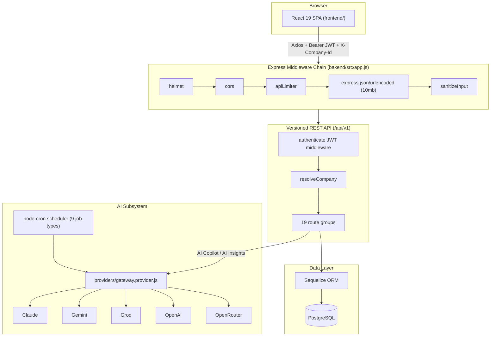
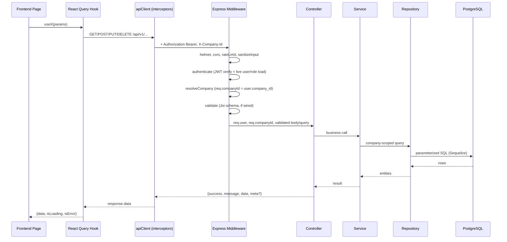
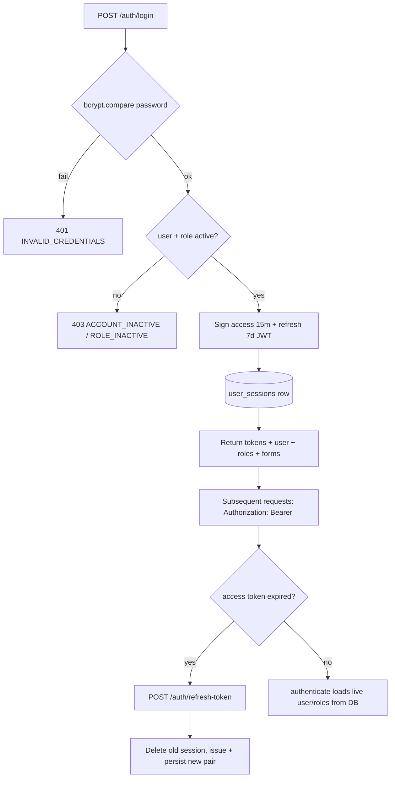
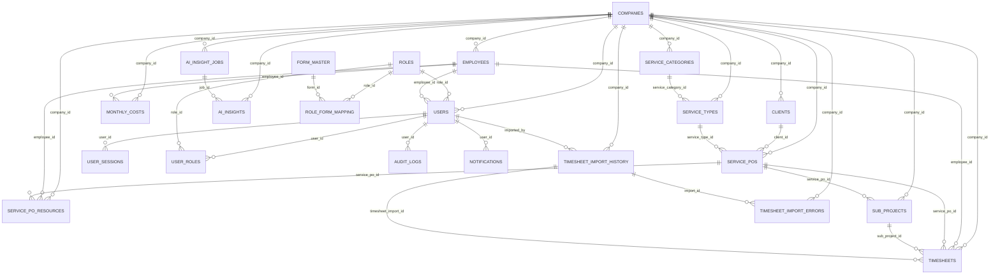

# Trackio — Resource Utilization Tracker (RUT Portal)
### Full-Stack Product Requirements Document

> **Methodology note.** This document is generated exclusively from static analysis of the actual source code in this repository — `frontend/` (React 19 SPA) and `bakend/` (Node.js/Express + Sequelize/PostgreSQL API) — on the `pooja` branch, as of 2026-08-06. No feature, endpoint, table, or rule is invented. Where the implementation is ambiguous, incomplete, dead, or not derivable from code, this document says so explicitly ("Not Found in Source Code" / "Not identifiable from the current implementation"). Frontend sections are sourced from a prior exhaustive frontend-only pass (`FRONTEND_PRD.md`, retained at the repo root) reconciled against this pass; backend sections are sourced from a fresh line-by-line reading of every route, controller, service, repository, model, middleware, and validation file in `bakend/src/`.
>
> **Important environment caveat.** This checkout of `bakend/` contains only `bakend/src/` — there is **no `package.json`, no `.env`/`.env.example`, and no `database/migrations/` folder** present anywhere under `bakend/`. Consequently: (1) exact npm dependency versions for the backend cannot be confirmed and are described qualitatively (by `require()` usage) rather than by version number; (2) the Sequelize **models** are the sole source of truth for the database schema (no migration history to cross-check against); (3) some environment variables referenced in code (`process.env.X`) cannot be confirmed as actually configured anywhere — they are documented as "referenced in code" rather than "confirmed configured."

---

## Table of Contents

1. [Executive Summary](#1-executive-summary)
2. [Technology Stack](#2-technology-stack)
3. [System Architecture](#3-system-architecture)
4. [User Roles](#4-user-roles)
5. [Functional Modules](#5-functional-modules)
6. [Detailed Screens](#6-detailed-screens)
7. [Complete API Documentation](#7-complete-api-documentation)
8. [Database Documentation](#8-database-documentation)
9. [Authentication Flow](#9-authentication-flow)
10. [Authorization Matrix](#10-authorization-matrix)
11. [Business Rules](#11-business-rules)
12. [User Workflows](#12-user-workflows)
13. [Reports](#13-reports)
14. [Notifications](#14-notifications)
15. [Integrations](#15-integrations)
16. [Security](#16-security)
17. [Non-Functional Requirements](#17-non-functional-requirements)
18. [Configuration](#18-configuration)
19. [Known Limitations](#19-known-limitations)
20. [Future Enhancements](#20-future-enhancements)
21. [Acceptance Criteria](#21-acceptance-criteria)
22. [Traceability Matrix](#22-traceability-matrix)
23. [Glossary](#23-glossary)

---

## 1. Executive Summary

### Product Overview
Trackio (`VITE_APP_NAME=Trackio`, package name `rut-portal-frontend`) is a multi-tenant resource-utilization and project-financials tracker. A React 19 SPA frontend talks to a Node.js/Express + Sequelize/PostgreSQL backend (`bakend/`) over a versioned REST API (`/api/v1`). The system tracks employee time (timesheets), commercial engagements (Service POs), workforce costs (monthly costs), and surfaces analytics and AI-assisted insights to management.

### Purpose
Replace manual timesheet/PO/cost tracking spreadsheets with one system of record that: captures and imports employee work hours in bulk, tracks Service PO (project) budgets/utilization, computes workforce cost and billability analytics, and generates AI-assisted narrative insights (bench risk, PO-ending alerts, cost commentary, client concentration, etc.) on a schedule.

### Business Problem
Organizations staffing consultants/employees across client engagements need to reconcile three things that are traditionally tracked in disconnected spreadsheets: (1) who is billable/idle and for how many hours, (2) what each engagement (Service PO) is contractually worth vs. what's been delivered, and (3) what each employee actually costs per month. This system unifies all three against a single employee/PO/timesheet data model.

### Business Value
- Single source of truth for utilization %, bench risk, and billable/non-billable hour splits.
- Bulk Excel import pipelines reduce manual data entry for Employees, Clients, Service POs, Monthly Costs, and Timesheets.
- Scheduled AI-generated insights (9 job types, see [§11](#11-business-rules)) proactively surface risks (PO ending soon, sole-contributor risk, bench escalation) instead of requiring a manager to notice them.
- RBAC data model (Role → Form mapping) allows different back-office functions (HR, Finance, Management, Project Manager, Division Head) to see only their relevant screens — **as designed on the frontend**; see [§10](#10-authorization-matrix) for a material caveat about server-side enforcement.

### Target Users
- **Company Admin** — full back-office access per company/tenant; the only role exempted from most protected-account restrictions on the frontend.
- **Back-office functional roles** (HR, Finance, Management, Project Manager, Division Head, and any other role an admin defines) — scoped access per Role→Form mapping; a coarse `Read` vs `Read & Write` permission flag per role.
- **Employee** — a self-service persona intended for daily/monthly time logging and personal reports. **The frontend fully implements this persona's UI, but no corresponding backend API exists in this codebase (see [§19](#19-known-limitations)).**
- **Platform Admin** — a separate `is_platform_admin` flag (not a Role row), scoped only to Company (tenant) provisioning; explicitly locked out of every other route server-side.

### Primary Goals
1. Provide RBAC-gated CRUD for every master entity (Clients, Companies, Employees, Users, Roles, Forms, Service Categories/Types, Service POs, Sub-Projects).
2. Provide bulk Excel import for Employees, Clients, Service POs, Monthly Costs, and Timesheets with validation/preview.
3. Provide a Service PO lifecycle (resource allocation, sub-projects, utilization tracking, closing) — **with a confirmed status-enum bug that currently makes "close" and "allocate resources" unreachable in production, see [§11](#11-business-rules)**.
4. Provide a rich analytics Dashboard and 11 backend Report endpoints (5 frontend Reports screens) with fiscal-year/month filtering.
5. Provide scheduled and on-demand AI-generated insights, plus a conversational AI Copilot answering questions against real backend data.
6. Enforce multi-tenancy (`company_id` scoping) across business data, with a platform-admin layer for tenant provisioning.

---

## 2. Technology Stack

### Frontend
| Category | Technology | Version | Notes |
|---|---|---|---|
| UI Library | React | 19.0.0 | with `react-dom` 19.0.0 |
| Build Tool | Vite | 6.0.5 | alias `@`→`./src`, manual chunk splitting |
| Router | React Router DOM | 6.28.0 | `BrowserRouter`, no data-router APIs |
| Global State | Redux Toolkit + React Redux | 2.4.0 / 9.2.0 | slices: `auth`, `ui`, `navigationGuard` |
| Server State | TanStack React Query (+Devtools) | 5.62.0 | 5min staleTime / 10min gcTime default |
| Table | TanStack React Table | 8.21.3 | powers `DataTable.jsx` |
| Styling | Tailwind CSS + tailwindcss-animate | 3.4.17 | `darkMode:'class'`, CSS-variable tokens |
| UI Components | shadcn/ui (Radix UI primitives) | Radix ^1.x/^2.x | accordion, dialog, select, tabs, tooltip, etc. |
| Variant Engine | class-variance-authority + clsx + tailwind-merge | 0.7.1 / 2.1.1 / 2.5.5 | `cn()` helper |
| Forms | React Hook Form + @hookform/resolvers | 7.54.0 / 3.9.0 | paired with Zod |
| Validation | Zod | 3.24.0 | colocated per-form + shared `utils/validators.js` |
| HTTP Client | Axios | 1.7.9 | single instance, interceptor-based refresh |
| Charts | Recharts | 2.13.0 | 24 chart components |
| Date | Day.js | 1.11.13 | + relativeTime/localizedFormat plugins |
| Animation | Framer Motion | 11.14.0 | cards, tables, AI widget |
| Notifications | react-hot-toast | 2.4.1 | global `<Toaster>` |
| Excel | xlsx (SheetJS) | 0.18.5 | import parsing + export, client-side |
| PDF | jsPDF + jspdf-autotable | 4.2.1 / 5.0.8 | Employee list export |
| File Upload UI | react-dropzone | 14.3.5 | all import flows |

### Backend
| Category | Technology | Notes |
|---|---|---|
| Runtime/Framework | Node.js + Express | `bakend/src/app.js` entry point |
| ORM | Sequelize | PostgreSQL dialect, `underscored:true`, per-model `tableName` |
| Database | PostgreSQL | Connected via `pg` driver (used directly for advisory-lock migrations too) |
| Auth | `jsonwebtoken` (JWT) + `bcrypt` (12-round hashing) | Dual-secret access/refresh token scheme |
| Validation | Joi | Every `validations/*.js` file |
| File Upload | Multer | `.xlsx`/`.csv` whitelist, 10MB cap |
| Excel Parsing | `xlsx` (SheetJS) | Employee/Client/ServicePO/MonthlyCost/Timesheet import parsers |
| Scheduling | `node-cron` | AI Insight job scheduler (`scheduler.service.js`) |
| Security Headers | `helmet` | CSP, HSTS, frameguard, etc. |
| CORS | `cors` | Origin allowlist via `CORS_ORIGIN` |
| Rate Limiting | `express-rate-limit` (inferred from `rateLimiters.js` usage) | 5 named limiters |
| Input Sanitization | `xss` library + custom prototype-pollution guard | `middlewares/sanitizeInput.js` |
| Logging | Winston | Daily-rotating file transports |
| API Docs | Swagger (`swagger-ui-express`) | Mounted at `/api-docs` |
| Date/Time | `moment-timezone` | Default TZ `Asia/Kolkata` (`APP_TIMEZONE` override) |
| AI Providers | Multiple, behind a gateway (`providers/`) | Claude, Gemini, Groq, OpenAI, OpenRouter — see [§15](#15-integrations) |

### Database
PostgreSQL, accessed exclusively through Sequelize models (see [§8](#8-database-documentation)). No migrations directory exists in this checkout; `bakend/src/database/migrationRunner.js` documents an automatic *.sql migration runner design (advisory-lock-guarded, baseline-on-first-run) but the migration files it would run are not present here.

### Authentication
JWT (access + refresh, separately-secreted, refresh tokens persisted server-side in `user_sessions` for revocability/rotation). See [§9](#9-authentication-flow).

### State Management
Three-tier frontend model: Redux Toolkit (auth/ui/navigationGuard) + TanStack React Query (all server data) + local component/React-Hook-Form state. See `FRONTEND_PRD.md` §11 for full detail.

### Libraries
See tables above; full frontend dependency detail (lucide-react, cmdk, react-dropzone, etc.) is in `FRONTEND_PRD.md` §4.

### Deployment
Frontend: Vercel (`frontend/.vercel/`, `vercel.json` present; `frontend/dist/` is checked into the working tree, unusual and not explained by any code comment found). Backend: **Not Found in Source Code** — no Dockerfile, no `package.json`, no CI/CD config, no hosting-platform config file exists anywhere under `bakend/` in this checkout.

---

## 3. System Architecture

### High-Level Architecture


### Frontend Architecture
Pages own data-fetching via React Query hooks and compose feature components; a shadcn/ui (Radix + CVA + Tailwind) primitive layer underlies all UI; every route is `React.lazy`-loaded behind one global `<Suspense>`. Full detail in `FRONTEND_PRD.md` §3.

### Backend Architecture
Layered: **Routes** (Express routers, one file per resource, wire `authenticate`/`validate`/upload/rate-limit middleware) → **Controllers** (thin — parse request, call service, shape response via `utils/response.js`) → **Services** (business logic, transactions, cross-entity validation) → **Repositories** (Sequelize queries, company-scoping `where` clauses) → **Models** (Sequelize model defs, validators, hooks). A parallel **Validations** layer (Joi schemas) sits in front of controllers via `validateRequest.js`. AI subsystem is a separate vertical (`providers/`, `services/aiCopilotService.js`, `services/aiInsight.service.js`, `scheduler/aiInsight.scheduler.js`) reusing the same repositories/services for its underlying data.

### Database Architecture
21 Sequelize models / tables, mostly `company_id`-scoped for multi-tenancy (14 of 21 tables), with RBAC/reference tables (`roles`, `form_master`, `role_form_mapping`, `user_roles`) and per-user tables (`user_sessions`, `audit_logs`, `notifications`) currently **not** company-scoped. Full ER diagram and table-by-table documentation in [§8](#8-database-documentation).

### Request Flow


### Authentication Flow (overview — full detail in [§9](#9-authentication-flow))


---

## 4. User Roles

The system has **two orthogonal identity axes** that must not be conflated: (1) `users.is_platform_admin` (boolean, independent of any Role row) and (2) the `Role` catalog (arbitrary named rows a `User` can hold via legacy `role_id` and/or the `user_roles` many-to-many). **There is no `loginType`/`login_type` column anywhere in the backend** (confirmed absent by grep) — the frontend's "Employee" persona is a UI/UX concept only; see the caveat below.

### Platform Admin
- **Responsibilities**: provision new tenant companies (with their first Company Admin user and 3 default Service Categories) in one transaction.
- **Permissions (server-enforced)**: full CRUD on `/companies/*` only, gated by `requirePlatformAdmin` middleware checking `req.user.is_platform_admin === true`.
- **Restrictions**: `authenticate` middleware explicitly 403s (`PLATFORM_ADMIN_FORBIDDEN`) any request from this user type to any route not under `/companies` — hard server-side lockout from all business data.
- **Accessible Modules**: Company Management only (frontend: `/companies` route tree).

### Company Admin (Role row, name `"Company Admin"`)
- **Responsibilities**: full back-office administration for one tenant company — created automatically as the first user of a new company.
- **Permissions**: intended to be unrestricted within its company (hardcoded in the *unused* `authorize.js`'s `SUPERUSER_ROLES` bypass list alongside `"super admin"`). **In practice, since no route calls `authorize()`, this bypass has no runtime effect — a Company Admin's actual server-side permissions are identical to any other authenticated, active-role user in the same company** (see [§10](#10-authorization-matrix)).
- **Restrictions (frontend-only)**: none — exempted from the client-side "protected account" lockouts that apply to other users.
- **Accessible Modules**: all — frontend gates the "Administration" sidebar module (Users, Roles, Forms, Role↔Form / User↔Role mapping) to this role name specifically on the client.

### Business Roles (HR, Management, Finance, Project Manager, Division Head, or any custom name an admin creates)
- **Responsibilities**: vary by assignment — HR/Employees, Finance/Costs, Management/Analytics, Project Manager/Division Head/PO oversight (per Swagger comments and AI Insight `audience_roles`, not enforced access).
- **Permissions**: each Role row carries `permission` (`Read` or `Read & Write`) and `is_original_data_visible` (boolean) — both returned to the frontend at login and used **only client-side** to gate write actions and an Original/Modified data toggle. **Neither field is read or branched on anywhere in backend controllers/services outside the login-response serializer** (confirmed by agent grep) — there is no server-side Read-vs-Read&Write enforcement today.
- **Restrictions**: which screens ("Forms") a role can see is governed by `role_form_mapping` — a real, populated data model, consumed by the frontend Sidebar/`ProtectedRoute`. Not enforced server-side (no route checks whether the caller's role is actually mapped to the form/endpoint being hit).
- **Accessible Modules**: whatever `role_form_mapping` grants, as surfaced to the frontend at login/refresh.
- **One confirmed real server-side exception**: `PUT /users/:id/change-password` allows changing another user's password only if the caller is that user, or their `req.userRoles` includes the literal strings `'HR'` or `'Management'` — the only in-controller role-name check found anywhere in the 27 backend modules reviewed.

### Employee (frontend persona — no confirmed backend equivalent)
- **Responsibilities (as designed on the frontend)**: log daily/monthly hours against mapped Service POs, view own Dashboard/Reports.
- **Permissions**: frontend redirects a `loginType: 'employee'` session to a dedicated `/employee/*` route tree with its own layout/sidebar, entirely bypassing the RBAC Sidebar.
- **Restrictions**: **the backend has no `/employee-timesheets`, `/employee-reports`, `/employee-servicepo-mapping`, or `/employee-projects` routes mounted anywhere** (`app.js` mounts exactly 19 route groups; none match these paths — confirmed by direct inspection). The frontend's `employeeWorkLog.api.js`, `employeeReports.api.js`, `employeeServicePOMapping.api.js`, and `employeeProjects.api.js` call endpoints this backend does not implement. **This entire persona's backend is Not Found in Source Code.**
- **Accessible Modules (frontend only)**: Employee Dashboard, Timesheet (calendar + work-log entry), Reports (Daily/Monthly/Range).

### Server-Side Role Reality Summary
Beyond the platform-admin lockout and the two exceptions named above (change-password role check, self-delete block), **every authenticated user with at least one active role has identical server-side capability across all 27 business/admin modules**, regardless of which Role or Forms they're mapped to on the frontend. This is the single most important fact to carry into any security or compliance review of this system — see [§10](#10-authorization-matrix) and [§16](#16-security).

---

## 5. Functional Modules

Each module below follows: Purpose · Description · Business Rules · Dependencies · Navigation · API Endpoints · Database Tables · User Permissions · Validation Rules · Error Cases · Edge Cases · Acceptance Criteria. Full endpoint tables are in [§7](#7-complete-api-documentation); this section focuses on the rules and cross-references.

### 5.1 Authentication
- **Purpose**: issue/refresh/revoke sessions; the front door to every other module.
- **Business Rules**: bcrypt (12 rounds) password hashing; access tokens 15m, refresh tokens 7d, both env-configurable; refresh tokens are rotated (old session deleted, new issued) on every use; a user with no active role, or `status≠active`, is rejected even with a cryptographically valid token, because `authenticate` re-loads the live user/role state from the DB on every request.
- **Dependencies**: `User`, `Role`, `UserRole`, `Employee`, `Company`, `UserSession` models.
- **Navigation**: `/login` (frontend) → `POST /auth/login`.
- **API Endpoints**: `POST /auth/login`, `POST /auth/refresh-token`, `POST /auth/logout`, `GET /auth/profile`.
- **Database Tables**: `users`, `user_sessions`, `roles`, `user_roles`, `employees`, `companies`.
- **User Permissions**: public (login/refresh); authenticated (logout/profile).
- **Validation Rules**: `email` required valid format; `password` required min 6 chars (login only — no complexity check on login, only on creation/change).
- **Error Cases**: 401 `INVALID_CREDENTIALS`, 403 `ACCOUNT_INACTIVE`/`ROLE_INACTIVE`, 401 `TOKEN_EXPIRED`/`INVALID_TOKEN`, 401 `SESSION_NOT_FOUND` (refresh replay/rotation protection).
- **Edge Cases**: a user active in the DB but deactivated mid-session is rejected on their very next request (DB-backed enforcement, not purely stateless JWT trust); logging out with no `refresh_token` in the body is treated as a no-op success.
- **Acceptance Criteria**: A user with correct credentials and an active status/role receives a valid token pair and their forms/roles snapshot; an expired access token is transparently refreshed by the frontend's Axios interceptor without user-visible disruption; a revoked/rotated refresh token cannot be replayed.
- **Known gap**: `authValidation.js` defines `forgotPasswordSchema`/`resetPasswordSchema`/`changePasswordSchema`, but **no route or controller implements forgot-password/reset-password** — the frontend's 3-screen Forgot Password flow (email → OTP → reset) has no backend counterpart in this codebase. Password change is only reachable via `PUT /users/:id/change-password`.

### 5.2 Users
- **Purpose**: back-office login accounts, optionally linked to an `Employee` record.
- **Business Rules**: email uniqueness is **global** (not per-company) — a deliberate design choice, distinct from most other entities which are per-company unique. A user cannot deactivate their own account. `role_id` (legacy single FK) and `role_ids` (many-to-many via `user_roles`) coexist; at least one must be supplied on create.
- **Dependencies**: `Role`, `Employee`, `Company`, `UserRole`.
- **Navigation**: `/users` (Company Admin/Administration module, frontend).
- **API Endpoints**: `GET/POST/PUT/DELETE /users`, `PUT /users/:id/change-password`.
- **Database Tables**: `users`, `user_roles`, `roles`, `employees`.
- **User Permissions**: any authenticated user server-side (no role gate); frontend gates the screen to Company Admin via RBAC forms.
- **Validation Rules**: see table in [§11](#11-business-rules) (User).
- **Error Cases**: 409 email registered, 400 no role, 404 role/employee not found, 409 role/employee inactive, 403 self-deactivate blocked.
- **Edge Cases**: changing another user's password requires the caller's role name to literally be `HR` or `Management` — the only enforced business role check in the codebase.
- **Acceptance Criteria**: creating a user with a duplicate email is rejected; a user cannot delete their own account; role/employee references are validated to exist and be active before a user record is created or updated.

### 5.3 Roles
- **Purpose**: RBAC role catalog with a coarse permission flag and an original-data-visibility flag.
- **Business Rules**: `role_name` unique (case-insensitive); `'Platform Admin'`/`'Company Admin'` are always excluded from the list endpoint (`EXCLUDED_ROLE_NAMES`); **hard delete** (the only hard-delete entity in the system) is blocked (409) if the role is assigned to any user via either `role_id` or `user_roles`; deletion is transactional (mapping rows + role row together).
- **Dependencies**: `RoleFormMapping`, `UserRole`, `User`.
- **API Endpoints**: `GET/POST/PUT /roles`, `DELETE /roles/:id`.
- **Database Tables**: `roles` (global — no `company_id`).
- **Validation Rules**: `role_name` 2–50 chars; `permission` enum `Read`/`Read & Write`; `status` enum.
- **Error Cases**: 409 duplicate name, 409 role in use (on delete), 404 not found.
- **Acceptance Criteria**: a role cannot be deleted while assigned to any user; renaming a role re-validates uniqueness excluding itself.

### 5.4 RBAC — Role↔Form / User↔Role Mapping
- **Purpose**: the actual RBAC data source — which Forms (screens) a Role can see, and which Roles a User holds.
- **Business Rules**: `role_form_mapping` rows are **never physically deleted**, only toggled `status` true/false (soft mapping); `user_roles` supports a full-replace transaction (delete-all-then-insert) or granular add/remove.
- **API Endpoints**: `GET/POST/PUT/DELETE /roles/form-mappings/*`, `GET/POST/PUT/DELETE /roles/user-mappings/*`, `POST /roles/forms`, `POST /roles/forms/mapping`.
- **Database Tables**: `role_form_mapping`, `user_roles`, `form_master`, `roles`, `users`.
- **Validation Rules**: all IDs positive integers; `replaceRoleFormMappingsSchema.form_ids` allows an empty array (unmap everything).
- **Error Cases**: 404 role/form/user not found, 409 duplicate user-role mapping (on the single-add endpoint only, not the replace endpoint).
- **Edge Cases**: the mapping-fetch endpoint (`GET /roles/forms`) returns every form ever mapped including soft-unmapped ones — the frontend must filter to `status===true`.
- **Known gap**: **no company scoping anywhere in this module** — any authenticated user in any tenant company can read and rewrite the entire platform's role/form/permission configuration, since roles and forms are global, not per-tenant, and no route restricts this to Company Admins.

### 5.5 Forms (Form Master)
- **Purpose**: catalog of protectable screens/modules (not a form-builder).
- **Business Rules**: unique on `(module_name, form_name)`; delete is soft (`status='inactive'`), reusing the update code path so it's also audit-logged as an update, not a delete.
- **API Endpoints**: `GET/POST/PUT/DELETE /forms`.
- **Database Tables**: `form_master` (global).
- **Validation Rules**: `module_name`/`form_name` 1–100/1–150 chars.
- **Error Cases**: 409 duplicate `(module_name, form_name)` pair.
- **Acceptance Criteria**: deactivating a form makes it disappear from `role_form_mapping`-derived accessible-forms responses without deleting historical mapping rows.

### 5.6 Companies (Platform / Tenant Management)
- **Purpose**: tenant provisioning; the root of multi-tenancy.
- **Business Rules**: `POST /companies` is transactional and atomic — creates the `Company`, its first `Company Admin` user (role looked up by name; 500 if not seeded), and **3 default Service Categories** (Billable/Non-Billable/Customer Non-Billable with matching `report_bucket_key`s) so a brand-new company's dashboards/reports work immediately. No delete endpoint exists for companies (deactivate only, via `status`).
- **API Endpoints**: `GET/POST /companies`, `GET /companies/:id`, `PATCH /companies/:id`.
- **Database Tables**: `companies`, `users`, `roles`, `service_categories`.
- **User Permissions**: `requirePlatformAdmin` only.
- **Validation Rules**: `company_code` 2–20 (uppercased); `company_name` 2–150; `admin_email` valid; `admin_password` full complexity policy.
- **Error Cases**: 409 company_code exists, 409 admin_email exists (global), 500 Company Admin role not seeded.
- **Acceptance Criteria**: creating a company never leaves it without a working admin login; company code/admin credentials are immutable after creation (edit only allows name/status, matching the frontend's contract).

### 5.7 Clients
- **Purpose**: customer/client master, owner of Service POs.
- **Business Rules**: `client_code`/`client_name` unique **per company**; auto-generates a code if omitted (`CLT-YYYYMMDD-XXXX`, retried ≤5x); soft delete (`status='inactive'`) is **blocked (409)** if the client has any `active`-status Service PO.
- **API Endpoints**: `GET/POST/PUT/DELETE /clients`, `GET /clients/active/list`, `POST /clients/import`.
- **Database Tables**: `clients`, `service_pos` (referential check on delete).
- **Validation Rules**: see [§11](#11-business-rules).
- **Error Cases**: 409 duplicate code, 409 has active Service PO(s), 400 already inactive.
- **Acceptance Criteria**: a client with any active engagement cannot be deactivated until that engagement is closed/reassigned.

### 5.8 Employees
- **Purpose**: workforce master — anchor entity for cost, timesheets, and PO allocation.
- **Business Rules**: `employee_code` unique per company; `email_id` unique **globally** (mirrors the Users module split); soft delete (`is_deleted=true`, `status='inactive'`) blocked (409) if the employee has an allocation tied to an `active`-status Service PO.
- **API Endpoints**: `GET/POST/PUT/DELETE /employees`, `GET /employees/active/list`, `POST /employees/import`.
- **Database Tables**: `employees`, `service_po_resources` (referential check on delete).
- **Validation Rules**: `employee_code` pattern `/^[A-Z0-9_/#-]{2,20}$/`; `company_experience ≤ total_experience`; `date_of_leaving ≥ date_of_joining` (create only — this cross-check is **not** re-applied on update).
- **Error Cases**: 409 code/email conflict, 409 allocated to active PO(s) (lists blocking PO codes), 422 validation.
- **Acceptance Criteria**: importing a spreadsheet of employees skips (not aborts on) individual bad rows, reporting them per-row.
- **Frontend note**: `company_experience` is displayed as read-only/auto-computed on the frontend from `date_of_joining`; the backend Joi schema treats it as a regular optional numeric field with a cross-field ceiling check against `total_experience` — the frontend's auto-computation is a client-side convenience, not a backend-enforced derivation.

### 5.9 Notifications
- **Purpose**: per-user in-app notification feed.
- **Business Rules**: strictly per-user (`user_id` scoped) — **no company scoping at all**; hard delete (only entity besides Roles using hard delete).
- **API Endpoints**: `GET /notifications`, `PUT /notifications/mark-all-read`, `PUT /notifications/:id/read`, `DELETE /notifications/:id`.
- **Database Tables**: `notifications`.
- **Known gap**: **no public POST/create endpoint exists** — `notificationService.createNotification()` exists in code but nothing in the 27 reviewed backend modules calls it, and no route exposes it; how (or whether) notifications actually get created in production is Not Found in Source Code for these modules. The frontend's fully-built `NotificationPanel` component is also never mounted anywhere in the UI (see `FRONTEND_PRD.md` §22) — this is a full-stack orphaned feature.

### 5.10 Service Categories
- **Purpose**: top-level classification (e.g. Billable/Non-Billable/Customer Non-Billable) driving the `report_bucket_key` used throughout Dashboard/Reports.
- **Business Rules**: `name` unique per company (case-insensitive); soft delete via `is_deleted`.
- **API Endpoints**: `GET/POST/PUT/DELETE /service-categories`.
- **Database Tables**: `service_categories`.
- **Note**: seeded automatically (3 rows) on every company's creation — see §5.6.

### 5.11 Service Types
- **Purpose**: sub-classification under a Service Category, selected on every Service PO; its parent category's `report_bucket_key` determines a PO's `is_billable` derivation on import.
- **Business Rules**: `service_type_name` unique per company; soft delete via `is_deleted`.
- **API Endpoints**: `GET/POST/PUT/DELETE /service-types`.
- **Database Tables**: `service_types`, `service_categories`.

### 5.12 Sub-Projects
- **Purpose**: optional child breakdown under a Service PO for timesheet logging.
- **Business Rules**: `sub_project_code` auto-generated (`SP-YYYYMMDD-XXXX`); soft delete blocked if any `Timesheet` rows reference it. **Inconsistency found**: the "parent PO must be active" check is live on the update path (when reassigning `service_po_id`) but is **commented out** on the create path — a sub-project can currently be created under a PO of any status.
- **API Endpoints**: `GET/POST/PUT/DELETE /sub-projects`, `GET /sub-projects/by-po/:poId`.
- **Database Tables**: `sub_projects`, `service_pos`, `timesheets` (referential check on delete).
- **Validation Rules**: `end_date ≥ start_date`; `sub_project_name` 3–200 chars (Joi) — note the **frontend** documents this field as 1–150 chars ("Not identifiable" which is authoritative without re-checking both; treat the backend Joi rule as server-enforced truth).

### 5.13 Service POs (core "project" entity)
- **Purpose**: the commercial engagement record — client, value, dates, billing terms, staffing, sub-projects, timesheets all hang off this.
- **Business Rules — CONFIRMED BUG**: `ServicePO.status` (model + Joi) only ever takes one of `in-progress|completed|on-hold|pending|cancelled|closed` (default `pending`) — **`active` is not a valid value anywhere in the schema.** Yet `servicePOService.js` gates both `POST /service-pos/:id/close` (`ALLOWED_CLOSE_FROM=['active']`) and `POST /service-pos/:id/allocate` (requires `po.status==='active'`) on that non-existent value. **As written, no Service PO can ever be closed or have resources allocated to it via these two endpoints** — every call will 400 on a status check that can never pass. A separate, workable notion of "active" (`status IN ('in-progress','on-hold','pending')`) is used correctly elsewhere (`GET /service-pos/active/list`, timesheet PO-eligibility). This should be treated as a **P1 defect** for any team picking up this codebase.
- **Business Rules (working)**: `is_billable` is always computed at import time from the resolved Service Type's category (`report_bucket_key==='billable'`), never read from the import sheet; `service_po_code` auto-generated (`PO-YYYYMMDD-XXXX`) unless supplied; `client_id` must reference an `active` client; edits blocked once `status` is `closed`/`cancelled`; creating a PO fires a fire-and-forget `new_po_staffing_suggestion` AI Insight job.
- **API Endpoints**: `GET/POST/PUT/DELETE /service-pos`, `/active/list`, `/:id/close`, `/:id/allocate`, `/:id/resources/:employeeId`, `/:id/utilisation`, `/import`.
- **Database Tables**: `service_pos`, `clients`, `service_types`, `service_po_resources`, `sub_projects`, `timesheets`.
- **Validation Rules**: see [§11](#11-business-rules) table.
- **Error Cases**: 404 client/service-type not found, 400 inactive client / closed-cancelled PO edit / (effectively-always) status-check failure on close/allocate, 409 duplicate code.
- **Edge Cases**: `GET /service-pos/:id/utilisation` uses yet a **third**, simpler utilization formula (all-time hours ÷ `expected_man_hours`, no period filter, no modified-hours/publish gating) distinct from the Dashboard's and Reports' own utilization calculations — see [§11](#11-business-rules) for all three formulas side by side.
- **Acceptance Criteria (as currently shippable)**: a PO can be created, edited, soft-deleted (cancelled), imported in bulk, and queried for utilization; close/allocate require the P1 bug above to be fixed before they can be considered acceptance-tested.

### 5.14 Monthly Costs
- **Purpose**: per-employee-per-month salary/ops/billable cost snapshot feeding cost analytics.
- **Business Rules**: `(employee_id, month_year)` unique; `total_cost = salary_cost + ops_cost` (rounded 2dp); `per_hour_rate = total_cost / working_hours` (default 176) is computed and audit-logged but **not persisted as a column**; `POST /monthly-costs/calculate` bulk-recalculates `total_cost` for a month but its `working_hours` parameter is **not actually used** to recompute `per_hour_rate` in that bulk path (dead parameter); hard delete (no soft-delete flag on this table).
- **API Endpoints**: full CRUD + bulk delete (`ids`), period delete (`/sheet`), `/calculate`, `/import`.
- **Database Tables**: `monthly_costs`, `employees`.
- **Validation Rules**: cost fields 0 to 999,999,999,999,999 (2dp precision); `month` 1–12; `year` 2020–2100.
- **Import Business Rule**: upserts on `(employee_id, month, year)` — an existing record is updated, not duplicated; max 500 rows per file; employee resolved by code (preferred) or name.
- **Known inconsistency**: `services/monthlyCostService1.js` exists in the repo (~25KB) but is **dead code** — never imported anywhere; only `monthlyCostService.js` is live.

### 5.15 Timesheets
- **Purpose**: the official record of hours worked, via Excel upload or (intended, but not implemented — see §5.16 below) employee self-service sync.
- **Business Rules**: `hours_logged` is immutable once inserted (original/imported value); `modified_hours` is the admin-adjustable "effective" value, starting equal to `hours_logged`; `is_publish` is a **one-way** flag (row-level and batch-level) — once true, never reset; confirming an import **replaces the entire calendar month's data for the company** (deletes all existing rows/import-history for that month, not just the new batch, then bulk-inserts); a 176-hour monthly cap is enforced (proportionally scaled down at import time, hard-rejected on manual create/update); duplicate `(employee_id, service_po_id, timesheet_date)` is a DB-level unique constraint.
- **Trust-boundary finding**: the `role` parameter controlling hours-visibility (`GET /timesheets*`) and `roleId` controlling publish-gating (Dashboard/Reports) are both **client-supplied request parameters, not derived from the authenticated JWT/session** — any caller can pass `?role=management` or `roleId=5` regardless of their actual assigned role. This is documented in code as a deliberate product decision, not a bug, but it is a real trust-boundary gap worth flagging to a security reviewer.
- **API Endpoints**: full CRUD + `/upload`, `/confirm/:importId`, `/import/history`, `/import/:id`, `/import/:id/rows`, `/import/:id/hours`, `/import/:id/publish`, `/:id/modified-hours`.
- **Database Tables**: `timesheets`, `timesheet_import_history`, `timesheet_import_errors`, `employees`, `service_pos`, `sub_projects`.
- **Known dead code**: `timesheetService1.js`, `timesheetService2.js`, `timesheetServiceWorking.js` (~38-40KB each) exist but are never imported; only `timesheetService.js` (~72KB) is live.
- **Frontend/Backend mismatch**: the frontend's `SyncWorkLogsDialog` ("sync employee work-log drafts") calls `POST /timesheets/sync-employee-worklogs`, which **does not exist among the timesheet routes actually inventoried** — consistent with the broader finding in §5.16 that the employee self-service backend is absent.

### 5.16 Employee Self-Service (Dashboard, Timesheet, Reports, PO Mapping)
- **Purpose (frontend design intent)**: let an Employee-type login view their dashboard, log daily/monthly hours against mapped Service POs, and view their own report history; let an admin manage which POs an employee can log time against.
- **Status: Not Found in Source Code (backend).** `bakend/src/app.js` mounts exactly 19 route groups (`auth, employees, users, roles, companies, roles(rbac), forms, clients, service-pos, service-categories, service-types, sub-projects, monthly-costs, timesheets, reports, dashboard, notifications, ai-insights, ai`). None of these serves `/employee-timesheets`, `/employee-reports`, `/employee-servicepo-mapping`, or `/employee-projects` — the exact paths the frontend's `employeeWorkLog.api.js`, `employeeReports.api.js`, `employeeServicePOMapping.api.js`, and `employeeProjects.api.js` call. This module is fully built on the frontend (calendar UI, work-log entry table, daily/monthly/range reports, admin PO-mapping screens) but has **no reachable backend in this codebase**.
- **Acceptance Criteria**: cannot be assessed/tested until a backend implementation is confirmed to exist (possibly in a different deployment/branch not included in this checkout) — flagged for immediate follow-up with the backend owner.

### 5.17 Dashboard (Analytics)
- **Purpose**: management-facing KPI/analytics surface.
- **Business Rules**: `hoursSource` param (`O`=original `hours_logged` vs default=`COALESCE(modified_hours, hours_logged)`) applied consistently across ~10 repository functions; `roleId=5` triggers a publish-gate (unpublished timesheet data excluded, or entire report blocked if the period isn't fully published); fiscal year = April→March; **`/dashboard/analytics2`'s 9 sub-reports are inconsistently period-scoped** — 6 respect the query filters, 3 (`client_wise_cost_analytics`, `top_clients_by_cost`, `client_category_cost_matrix`) are always all-time regardless of filters (documented in the route's own Swagger text, easy for an API consumer to miss).
- **API Endpoints**: `/dashboard/stats`, `/employee-billable-breakdown`, `/po-billable-breakdown`, `/top-employees-by-po`, `/billable-trend`, `/analytics`, `/analytics2`.
- **Database Tables**: reads across `timesheets`, `service_pos`, `employees`, `clients`, `service_types`, `service_categories`, `monthly_costs`.
- **Rate Limiting**: `heavyReportLimiter` on every route in this module.

### 5.18 Reports
- **Purpose**: 11 backend report endpoints backing the frontend's 5 Reports screens plus additional data feeding the AI Copilot.
- **Business Rules**: two different "standard monthly hours" constants coexist with no single source of truth — **176** (`employee-hourly-rate`, `employee-utilization-summary`, `monthly-resource-utilization`'s actual SQL) vs **160** (`service-po-summary`'s hourly-rate divisor, and `monthly-resource-utilization`'s *Swagger doc only* — a confirmed doc/code mismatch, since the live SQL uses 176 despite documenting 160). Two of eleven report endpoints document a `status` filter enum of `[active, closed, all]` that **does not match** the real `ServicePO.status` enum (no `active` value exists) — passing the documented value silently returns zero rows.
- **API Endpoints**: see full table in [§7](#7-complete-api-documentation)/[§13](#13-reports).
- **Note**: unlike every other module, `report.routes.js` applies **no Joi validation middleware at all** — required-param checks (`month`/`year`) are hand-rolled inside `reportService.js`, throwing 422s manually.

### 5.19 AI Copilot
- **Purpose**: conversational Q&A over the system's own analytics data.
- **Business Rules**: intent classification is **deterministic keyword matching**, not an LLM call — 12 supported intents (utilization, bench, timesheet, cost, revenue, profit, client, project, resource, employee, comparison, executive_summary) each backed by an existing report/dashboard data source; 4 intents (forecast, recommendation, project_health, what_if) are recognized only so the system can honestly decline rather than fabricate; unsupported-only questions never call the LLM at all; every collector caps rows sent to the model at 25 (`MAX_ROWS_TO_AI`), distinct from the underlying report's real pagination.
- **API Endpoints**: `POST /ai/query`.
- **Database Tables**: reads-only, no dedicated table.
- **Rate Limiting**: `aiLimiter` (20 req/15min default).

### 5.20 AI Insights
- **Purpose**: scheduled/event-driven AI-generated narrative insights (bench risk, PO-ending alerts, cost commentary, etc.) per company.
- **Business Rules**: 9 job types defined (see [§11](#11-business-rules) for the full cadence table); each cron fires once per **active company** independently (`Promise.allSettled`, one company's failure never blocks another); job definitions are seeded once and never overwritten by the seeder (admin edits to cadence/active-flag persist across restarts); a collector returning nothing is recorded as a successful no-op, not a failure.
- **API Endpoints**: `GET /ai-insights` (list, filterable), plus on-demand `POST /run/:jobKey`, `POST /run-all` (inferred from `aiInsight.service.js`'s `runJob`/`runAllJobs` design — exact route paths not enumerated by the API-inventory agents; treat as **present but not exhaustively path-confirmed**).
- **Database Tables**: `ai_insight_jobs`, `ai_insights`.
- **Known discrepancy**: a `timesheet_compliance` data collector exists in `aiInsight.service.js` but has **no corresponding job definition** in `aiInsightJobRepository.js` — it is never seeded, scheduled, or reachable via `runAllJobs`.

---

## 6. Detailed Screens

Full per-screen field/button/validation/table detail for all ~90 frontend page components is maintained in `FRONTEND_PRD.md` §6–§9 (Module/Screen/Component/Form Documentation) and is incorporated here by reference to avoid duplicating ~600 lines of already-verified content. Key cross-cutting mechanics (frontend-confirmed):

| Aspect | Behavior |
|---|---|
| Form layout | Right-side sliding `Sheet` drawer for nearly every CRUD form (not full-page, not center modal) |
| Filters | Collapsible "Filters" panel per list screen, badge shows active-filter count |
| Search | Single debounced (400ms) text box; Employee/User require ≥3 chars before firing |
| Sorting | Server-side single-column sort via `DataTable`, **except** Service Category/Service Type (client-side slice of an already-fetched page — inconsistent with the rest) |
| Pagination | Server-driven (`meta.total/current_page/per_page`) almost everywhere; page-size 10/20/50/100 |
| Export | Excel (SheetJS, client-side generation from a re-fetched full dataset) on most list screens; PDF (jsPDF) on Employee list only |
| Import | react-dropzone-based upload UI on Client/Employee/ServicePO/MonthlyCost/Timesheet, each with its own preview/validation UX |
| Notifications | `react-hot-toast` for every mutation outcome |
| Loading | Skeleton loaders (list tables, forms, KPI tiles); one full-screen `LoadingScreen` for route-level Suspense/RBAC gates |
| Empty states | Shared `EmptyState` common component |
| Permissions | `useCanWrite()` (Read vs Read&Write) + `useHasForm()` (RBAC form gate) + `isProtectedAccount()` (hardcoded `Company Admin` lockout) — all three are **client-side only enforcement**, see [§10](#10-authorization-matrix) |

Screen-by-screen module list (each documented in `FRONTEND_PRD.md` §6): Clients, Companies (Platform Admin only), Employees, Roles, Role↔Form Mapping, Service Categories, Service Types, Sub-Projects, Users, User↔Role Mapping, Forms, Service POs (+ Detail + Import), Monthly Costs (+ Detail + Import), Timesheets (+ Upload + Import Detail), Dashboard, 5 Reports screens, 7 AI insight pages, Notifications (placeholder — see [§14](#14-notifications)), Employee Dashboard/Timesheet/Reports (backend absent — see §5.16).

---

## 7. Complete API Documentation

**Cross-cutting conventions (apply to every endpoint below unless noted):**
- **Base path**: `/api/v1` (`API_PREFIX` env var).
- **Headers**: `Authorization: Bearer <accessToken>` (all routes except `POST /auth/login`, `POST /auth/refresh-token`); `X-Company-Id` accepted but **not trusted** — `resolveCompany` derives `req.companyId` from the authenticated user's DB record and only logs (does not block, by default) a mismatch against this header (`COMPANY_SCOPE_SHADOW_MODE`).
- **Response envelope**: `{ success: boolean, message: string, data, meta? }`; errors: `{ success: false, message, errors? }`. In production, any 5xx message is replaced with a generic "An internal server error occurred." regardless of the underlying error.
- **Authentication Required**: "Yes" below means the `authenticate` middleware is applied; it always implies `resolveCompany` runs immediately after.
- **Business Logic / Related Screen**: cross-referenced to [§5](#5-functional-modules) and `FRONTEND_PRD.md` §5 (Route Documentation) respectively — see the [Traceability Matrix](#22-traceability-matrix) for the full mapping.

### 7.1 Auth
| Method | URL | Auth | Request | Response | Errors |
|---|---|---|---|---|---|
| POST | `/auth/login` | No (rate-limited: `authLimiter`) | `{email, password}` | `{accessToken, refreshToken, expiresIn, user, roles[], forms{}}` | 401 `INVALID_CREDENTIALS`, 403 `ACCOUNT_INACTIVE`/`ROLE_INACTIVE`, 422 |
| POST | `/auth/refresh-token` | No (valid refresh token) | `{refresh_token}` | New token pair + user/roles/forms | 400 `MISSING_TOKEN`, 401 `INVALID_REFRESH_TOKEN`/`SESSION_NOT_FOUND`, 403 `ACCOUNT_INACTIVE` |
| POST | `/auth/logout` | Yes | `{refresh_token?}` | `null` | none (idempotent) |
| GET | `/auth/profile` | Yes | — | Sanitized user (role, roles, employee, company) | 404 `USER_NOT_FOUND` |

### 7.2 Users
| Method | URL | Auth | Request | Response | Errors |
|---|---|---|---|---|---|
| GET | `/users` | Yes | Query: page, limit, search, status, role_id, sort_by/order (unvalidated) | Paginated users | — |
| GET | `/users/:id` | Yes | — | User + relations | 404 |
| POST | `/users` | Yes | email, password, confirm_password, role_id?/role_ids?, employee_id?, status? | Created user | 409, 400, 404 |
| PUT | `/users/:id` | Yes | Partial | Updated user | 404, 409 |
| DELETE | `/users/:id` | Yes | — | Deactivated user | 403 self, 404 |
| PUT | `/users/:id/change-password` | Yes (self or role HR/Management) | `{old_password, new_password}` | `null` | 403, 400, 401, 404 |

### 7.3 Roles
| Method | URL | Auth | Request | Response | Errors |
|---|---|---|---|---|---|
| GET | `/roles` | Yes | Query (unvalidated) | Flat array (no pagination), excludes Platform/Company Admin | — |
| GET | `/roles/:id` | Yes | — | Role | 404 |
| POST | `/roles` | Yes | role_name, permission?, status?, is_original_data_visible? | Created role | 409, 422 |
| PUT | `/roles/:id` | Yes | Partial | Updated role | 404, 409 |
| DELETE | `/roles/:id` | Yes | — | `null` (hard delete) | 404, 409 (in use) |

### 7.4 RBAC (mounted on `/roles`)
| Method | URL | Auth | Request | Response | Errors |
|---|---|---|---|---|---|
| POST | `/roles/forms` | Yes | `{roleIds[]}` | Forms grouped by module | 422 |
| POST | `/roles/forms/mapping` | Yes | `{roleId, formId, status}` | Mapping (upsert) | 404, 422 |
| GET | `/roles/user-mappings/:userId` | Yes | — | UserRole[] | 404 |
| POST | `/roles/user-mappings` | Yes | `{user_id, role_id}` | Mapping | 404, 409 |
| PUT | `/roles/user-mappings/:userId` | Yes | `{role_ids[]}` | Replaced mappings | 404, 422 |
| DELETE | `/roles/user-mappings/:userId/:roleId` | Yes | — | `null` | 404, 400 |
| GET | `/roles/form-mappings/:roleId` | Yes | — | RoleFormMapping[] | 404 |
| GET | `/roles/form-mappings?id=` | Yes | Query: id | Single mapping | 404, 422 |
| POST | `/roles/form-mappings` | Yes | `{role_id, form_id}` | Mapping (status=true) | 404, 422 |
| DELETE | `/roles/form-mappings/:roleId/:formId` | Yes | — | `null` (soft unmap) | 404 |
| PUT | `/roles/form-mappings/:roleId` | Yes | `{form_ids[]}` | Replaced mappings | 404, 422 |

### 7.5 Forms
| Method | URL | Auth | Request | Response | Errors |
|---|---|---|---|---|---|
| GET | `/forms` | Yes | status, search | FormMaster[] | — |
| GET | `/forms/:id` | Yes | — | Form | 404 |
| POST | `/forms` | Yes | module_name, form_name, status? | Created form | 409, 422 |
| PUT | `/forms/:id` | Yes | Partial | Updated form | 404, 409 |
| DELETE | `/forms/:id` | Yes | — | Deactivated form | 404 |

### 7.6 Companies
| Method | URL | Auth | Request | Response | Errors |
|---|---|---|---|---|---|
| GET | `/companies` | Yes + `requirePlatformAdmin` | status, search | Company[] | — |
| GET | `/companies/:id` | Yes + `requirePlatformAdmin` | — | Company | 404 |
| POST | `/companies` | Yes + `requirePlatformAdmin` | company_code, company_name, admin_email, admin_password | `{company, admin}` | 409×2, 500, 422 |
| PATCH | `/companies/:id` | Yes + `requirePlatformAdmin` | company_name?, status? | Updated company | 404, 422 |

### 7.7 Clients
| Method | URL | Auth | Request | Response | Errors |
|---|---|---|---|---|---|
| POST | `/clients/import` | Yes (`importLimiter`) | multipart file | `{total, imported, skipped, error_rows[]}` | 400, 422 |
| GET | `/clients/active/list` | Yes | — | Lightweight active list | — |
| GET | `/clients` | Yes | page, limit, status, search, industry, sort | Paginated Client[] | — |
| GET | `/clients/:id` | Yes | — | Client | 404 |
| POST | `/clients` | Yes | client_code?, client_name, industry?, status? | Created client | 422, 500 (code retry exhausted) |
| PUT | `/clients/:id` | Yes | Partial | Updated client | 404, 409 |
| DELETE | `/clients/:id` | Yes | — | 204 | 404, 400, 409 (active PO) |

### 7.8 Employees
| Method | URL | Auth | Request | Response | Errors |
|---|---|---|---|---|---|
| POST | `/employees/import` | Yes (`importLimiter`) | multipart file | `{total, imported, skipped, error_rows[]}` | 422, 400 |
| GET | `/employees/active/list` | Yes | — | Active list | — |
| GET | `/employees` | Yes | page, limit, search, status, designation, sort (unvalidated) | Paginated Employee[] | — |
| GET | `/employees/:id` | Yes | — | Employee | 404 |
| POST | `/employees` | Yes | employee_code, full_name, ... | Created employee | 409×2, 422 |
| PUT | `/employees/:id` | Yes | Partial | Updated employee | 404, 409 |
| DELETE | `/employees/:id` | Yes | — | Deactivated employee | 404, 409 (allocated to active PO) |

### 7.9 Notifications
| Method | URL | Auth | Request | Response | Errors |
|---|---|---|---|---|---|
| GET | `/notifications` | Yes (own only) | is_read, type, sortOrder, page, limit | Paginated + `unread_count` | — |
| PUT | `/notifications/mark-all-read` | Yes | — | `{updated}` | — |
| PUT | `/notifications/:id/read` | Yes (own only) | — | Notification | 404 |
| DELETE | `/notifications/:id` | Yes (own only) | — | 204 (hard delete) | 404 |

### 7.10 Service Categories / Service Types
| Method | URL | Auth | Request | Response | Errors |
|---|---|---|---|---|---|
| GET/POST/PUT/DELETE | `/service-categories[/:id]` | Yes | name, status | CRUD responses | 409, 404 |
| GET/POST/PUT/DELETE | `/service-types[/:id]` | Yes | service_type_name, service_category_id? | CRUD responses | 409, 404 |

### 7.11 Sub-Projects
| Method | URL | Auth | Request | Response | Errors |
|---|---|---|---|---|---|
| GET | `/sub-projects` | Yes | page, limit, status, service_po_id, search, sort | Paginated + nested PO/client/type | — |
| GET | `/sub-projects/by-po/:poId` | Yes | — | Array for that PO | 404 |
| GET | `/sub-projects/:id` | Yes | — | Sub-project | 404 |
| POST | `/sub-projects` | Yes | service_po_id, sub_project_name, description?, start/end_date, status? | Created | 404 (PO not found) |
| PUT | `/sub-projects/:id` | Yes | Partial + sub_project_code? | Updated | 404, 400 (inactive PO on reassign), 409 |
| DELETE | `/sub-projects/:id` | Yes | — | Success msg | 404, 409 (has timesheets) |

### 7.12 Service POs
| Method | URL | Auth | Request | Response | Errors |
|---|---|---|---|---|---|
| POST | `/service-pos/import` | Yes (`importLimiter`) | multipart file | `{total, imported, skipped, error_rows[]}` | 400, 422 |
| GET | `/service-pos/active/list` | Yes | — | Lightweight list, status ∈ {in-progress,on-hold,pending} | — |
| GET | `/service-pos` | Yes | page, limit, status, client_id, service_type_id, is_billable, search, date range, sort | Paginated PO[] | — |
| GET | `/service-pos/:id` | Yes | — | Full PO + allocated employees | 404 |
| POST | `/service-pos` | Yes | service_po_name, client_id, service_type_id, dates, ... | Created PO (fires AI insight job) | 404, 400, 409 |
| PUT | `/service-pos/:id` | Yes | Partial | Updated PO | 404, 400 (closed/cancelled), 409 |
| DELETE | `/service-pos/:id` | Yes | — | 204 (soft: cancelled) | 404 |
| POST | `/service-pos/:id/close` | Yes | — | Success msg | **Effectively always 400 — see [§11](#11-business-rules) bug** |
| POST | `/service-pos/:id/allocate` | Yes | `{employee_ids[]}` | Success msg | **Effectively always 400 — see bug above** |
| DELETE | `/service-pos/:id/resources/:employeeId` | Yes | — | 204 | 404 |
| GET | `/service-pos/:id/utilisation` | Yes | — | Utilization object (all-time, own formula) | 404 |

### 7.13 Monthly Costs
| Method | URL | Auth | Request | Response | Errors |
|---|---|---|---|---|---|
| GET | `/monthly-costs` | Yes | page, limit, employee_id, month, year, search, sort | Paginated | — |
| GET | `/monthly-costs/:id` | Yes | — | Record | 404 |
| POST | `/monthly-costs` | Yes | employee_id, month, year, salary_cost, ops_cost?, billable_cost? | Created (computed total_cost) | 404, 400, 409 |
| PUT | `/monthly-costs/:id` | Yes | Partial | Updated (recomputed) | 404, 409 |
| DELETE | `/monthly-costs/:id` | Yes | — | Success msg (hard delete) | 404 |
| DELETE | `/monthly-costs` | Yes | `{ids[]}` or `{id}` | `{deletedCount}` | 404, 422 |
| DELETE | `/monthly-costs/sheet` | Yes | `{months:[{month,year}]}` | `{deletedCount}` | 404, 422 |
| POST | `/monthly-costs/calculate` | Yes | month, year, working_hours? | `{processed, updated, summary}` | 404 |
| POST | `/monthly-costs/import` | Yes (`importLimiter`) | multipart Excel | `{total_rows, imported, updated, failed, duplicates}` | 400, 422 |

### 7.14 Timesheets
| Method | URL | Auth | Request | Response | Errors |
|---|---|---|---|---|---|
| GET | `/timesheets/import/history` | Yes | page, limit, month, year | Paginated batches | — |
| GET | `/timesheets/import/:id` | Yes | — | Import + errors | 404 |
| GET | `/timesheets/import/:id/rows` | Yes | role (client-supplied) | Rows, hours-visibility-shaped | — |
| DELETE | `/timesheets/import` | Yes | `{ids[]}` | Deletion summary | 404, 422 |
| POST | `/timesheets/upload` | Yes (`importLimiter`) | file + month, year | Preview object | 400, 422 |
| POST | `/timesheets/confirm/:importId` | Yes | — | `{insertedRows, errorRows, duplicates}` | 404, 409, 422 |
| GET | `/timesheets` | Yes | page, limit, date range, employeeId, poId, subProjectId, sort, role | Paginated, visibility-shaped | — |
| GET | `/timesheets/:id` | Yes | role | Single row | 404 |
| POST | `/timesheets` | Yes | employee_id, service_po_id, timesheet_import_id, timesheet_date, hours_logged, ... | `{id}` | 422, 400 (176h cap), 409 |
| PUT | `/timesheets/:id` | Yes | Partial | Updated row | 404, 409 |
| PATCH | `/timesheets/:id/modified-hours` | Yes | `{modified_hours}` | Updated row (`is_publish=true`) | 404, 422 |
| PUT | `/timesheets/import/:id/hours` | Yes | `{timesheets:[{id,hours}]}` | `{updated_records}` | 422, 400 (cap) |
| PUT | `/timesheets/import/:id/publish` | Yes | — | `{timesheetImportId}` | 422 |
| DELETE | `/timesheets/:id` | Yes | — | 204 (hard delete) | 404 |
| DELETE | `/timesheets` | Yes | `{ids[]}` | Deletion summary | 404, 422 |

### 7.15 Dashboard
| Method | URL | Auth | Request | Response |
|---|---|---|---|---|
| GET | `/dashboard/stats` | Yes (`heavyReportLimiter`) | month, year | KPI + chart bundle |
| GET | `/dashboard/employee-billable-breakdown` | Yes | month, year, page, limit, filters, hoursSource, roleId | Paginated per-employee split |
| GET | `/dashboard/po-billable-breakdown` | Yes | same family | Paginated per-PO classification |
| GET | `/dashboard/top-employees-by-po` | Yes | + type/category filters | Paginated PO→top-3-employee |
| GET | `/dashboard/billable-trend` | Yes | month, year, months(2-24) | Time series + deltas |
| GET | `/dashboard/analytics` | Yes | fiscalYear/quarter/month/year/date-range + filters | 7 tiles + 5 charts |
| GET | `/dashboard/analytics2` | Yes | same + topClients pagination | 9 reports (3 always all-time — see §5.17) |

### 7.16 Reports
| Method | URL | Auth | Required Params |
|---|---|---|---|
| GET | `/reports/employee-hourly-rate` | Yes | month, year (422 if missing) |
| GET | `/reports/monthly-cost-summary` | Yes | — |
| GET | `/reports/timesheet-summary` | Yes | — |
| GET | `/reports/service-po-utilisation` | Yes | — |
| GET | `/reports/sub-project-hours` | Yes | — |
| GET | `/reports/resource-allocation` | Yes | — |
| GET | `/reports/operational-cost-breakdown` | Yes | — |
| GET | `/reports/employee-utilization-summary` | Yes | month, year (422 if missing) |
| GET | `/reports/service-po-summary` | Yes | month, year (422 if missing) |
| GET | `/reports/resource-utilization` | Yes | month, year (422 if missing) |
| GET | `/reports/monthly-resource-utilization` | Yes | month, year (422 if missing) |
| GET | `/reports/resource-project-utilization-report` | Yes | (defaults to current month/year) |

All Reports routes: `heavyReportLimiter`; **no Joi query validation** on any route in this module (unique among all 27 modules reviewed).

### 7.17 AI Copilot / AI Insights
| Method | URL | Auth | Request | Response |
|---|---|---|---|---|
| POST | `/ai/query` | Yes (`aiLimiter`) | `{question, roleId?, hoursSource?}` | AI-generated answer or "unsupported topic" message |
| GET | `/ai-insights` | Yes | job_key?, severity?, is_read?, include_dismissed?, page, limit | Paginated insights |
| POST | `/ai-insights/run/:jobKey` (path inferred) | Yes | `{reference_id?}` (required for `new_po_staffing_suggestion`) | Run result |
| POST | `/ai-insights/run-all` (path inferred) | Yes | — | Per-job success/failed/skipped summary |

---

## 8. Database Documentation

**Source of truth**: `bakend/src/models/*.js` (21 models). No migrations folder exists in this checkout. Global Sequelize config: PostgreSQL dialect, `underscored: true`, `freezeTableName` effectively moot since every model declares its own `tableName`.

**Structural note**: every model's own `static associate(models)` method is dead code — `models/index.js` never calls it, instead redefining every association a second time in one central block. The associations documented below are the ones actually active at runtime (from `index.js`), which are consistent with (but distinct in code-path from) each model's own `associate()`.

### 8.1 Tables

*(See the exhaustive per-column tables produced during analysis — reproduced here in full for the PRD. All columns, constraints, associations, hooks, and indexes below are sourced directly from the model files.)*

**`companies`** — tenant root. `id PK`, `company_code STRING(20) UNIQUE NOT NULL`, `company_name STRING(150) NOT NULL`, `status ENUM(active,inactive) default active`, `is_deleted BOOLEAN default false`, `created_by/updated_by INTEGER`, timestamps. No FKs (root table).

**`roles`** — global RBAC catalog, **no `company_id`**. `id PK`, `role_name STRING(50) UNIQUE NOT NULL`, `permission ENUM(Read,'Read & Write') default Read`, `status ENUM default active`, `is_original_data_visible BOOLEAN default false`, `is_deleted BOOLEAN`, audit columns, timestamps.

**`employees`** — `id PK`, `company_id FK→companies.id`, `employee_code STRING(20)` (unique composite with company_id), `full_name STRING(100) NOT NULL`, `designation STRING(100)`, `total_experience/company_experience DECIMAL(4,1)`, `email_id STRING(150)`, `resource_description TEXT`, `date_of_joining/date_of_leaving DATEONLY` (leaving ≥ joining validator), `status ENUM`, `is_deleted BOOLEAN`, audit + timestamps. `beforeCreate` hook auto-generates `employee_code` if absent. hasMany: User, ServicePOResource, MonthlyCost, Timesheet.

**`users`** — `id PK`, `company_id FK→companies.id` (nullable, null only for platform admin), `is_platform_admin BOOLEAN default false`, `employee_id FK→employees.id`, `email STRING(100) UNIQUE NOT NULL`, `password STRING(255)` (bcrypt hash, excluded by default scope; `withPassword` scope includes it), `role_id FK→roles.id`, `status ENUM`, `last_login DATE`, `is_deleted BOOLEAN`, audit + timestamps. `beforeCreate`/`beforeUpdate` hooks bcrypt-hash the password (12 rounds). Instance method `validatePassword()`. belongsTo Role/Employee/Company; belongsToMany Role through UserRole; hasMany UserSession, AuditLog, Notification, TimesheetImportHistory (as importer).

**`clients`** — `id PK`, `company_id FK`, `client_code STRING(20)` (unique composite w/ company_id), `client_name STRING(100) NOT NULL`, `industry STRING(100)`, `status ENUM`, audit + timestamps. hasMany ServicePO.

**`service_categories`** — `id PK`, `company_id FK`, `name STRING(100)` (unique composite w/ company_id), `status STRING(10) default active`, `report_bucket_key STRING(30)` enum `billable|non_billable|customer_non_billable`, `is_deleted BOOLEAN`, audit + timestamps. hasMany ServiceType.

**`service_types`** — `id PK`, `company_id FK`, `service_type_name STRING(100)` (unique composite w/ company_id), `service_category_id FK`, `is_deleted BOOLEAN`, audit + timestamps. belongsTo ServiceCategory; hasMany ServicePO.

**`service_pos`** — `id PK`, `company_id FK`, `service_po_code STRING(30)` (unique composite w/ company_id), `service_po_name STRING(200) NOT NULL`, `client_id FK NOT NULL`, `service_type_id FK NOT NULL`, `po_value DECIMAL(15,2)`, `start_date/end_date DATEONLY` (end≥start validator), `expected_man_hours DECIMAL(10,2)`, `is_billable BOOLEAN default true`, `account_manager STRING(100)`, `service_description TEXT`, `invoice_frequency ENUM`, `invoice_amount DECIMAL(15,2)`, `status STRING(20) default pending` (isIn validator: in-progress/completed/on-hold/pending/cancelled/closed — **no "active" value, see §5.13 bug**), `is_deleted BOOLEAN`, audit + timestamps. belongsTo Client, ServiceType; hasMany ServicePOResource, SubProject, Timesheet; belongsToMany Employee through ServicePOResource.

**`service_po_resources`** — junction table. `id PK`, `company_id FK`, `service_po_id FK NOT NULL` (unique composite w/ employee_id), `employee_id FK NOT NULL`, `created_at` only (no `updated_at`). belongsTo ServicePO, Employee.

**`sub_projects`** — `id PK`, `company_id FK`, `sub_project_code STRING(30)` (unique composite w/ company_id), `service_po_id FK NOT NULL`, `sub_project_name STRING(200) NOT NULL`, `description TEXT`, `start_date/end_date DATEONLY` (end≥start), `status ENUM`, `is_deleted BOOLEAN`, audit + timestamps. belongsTo ServicePO; hasMany Timesheet.

**`monthly_costs`** — `id PK`, `company_id FK`, `employee_id FK NOT NULL` (unique composite w/ month_year), `month_year STRING NOT NULL`, `month`/`year` (VIRTUAL getters parsed from `month_year`, not real columns), `salary_cost/ops_cost/total_cost/billable_cost DECIMAL(15,2)`, audit columns, `created_at` only (no `updated_at`). belongsTo Employee.

**`timesheets`** — `id PK`, `company_id FK`, `employee_id FK NOT NULL` (unique composite w/ service_po_id + timesheet_date), `service_po_id FK NOT NULL`, `sub_project_id FK`, `timesheet_import_id FK`, `timesheet_date DATEONLY NOT NULL`, `hours_logged DECIMAL(5,2) NOT NULL` (0–999.99, immutable original), `modified_hours DECIMAL(5,2)` (admin-adjustable), `is_publish BOOLEAN default false` (one-way), audit columns, `created_at` only. belongsTo Employee, ServicePO, SubProject, TimesheetImportHistory.

**`timesheet_import_history`** — `id PK`, `company_id FK`, `imported_by FK→users.id NOT NULL`, `file_name/file_path STRING`, `total_rows/valid_rows/error_rows INTEGER default 0`, `import_month INTEGER (1-12)`, `import_year INTEGER (≥2000)`, `status ENUM(pending,processing,completed,failed,partial) default pending`, `is_publish BOOLEAN default false`, `created_at` only. belongsTo User (as importer); hasMany TimesheetImportError.

**`timesheet_import_errors`** — `id PK`, `company_id FK`, `import_id FK NOT NULL`, `row_number INTEGER`, `row_data JSONB`, `error_message TEXT`, `created_at` only. belongsTo TimesheetImportHistory.

**`audit_logs`** — `id PK`, `user_id FK`, `action STRING(50)`, `entity_type STRING(50)`, `entity_id INTEGER`, `old_values/new_values JSONB`, `ip_address STRING(45)`, `created_at` only. **No `company_id`.** belongsTo User.

**`notifications`** — `id PK`, `user_id FK NOT NULL`, `title STRING(200)`, `message TEXT`, `type ENUM(info,warning,error,success) default info`, `is_read BOOLEAN default false`, `created_at` only. **No `company_id`.** belongsTo User.

**`user_sessions`** — `id PK`, `user_id FK NOT NULL`, `refresh_token TEXT UNIQUE`, `expires_at DATE`, `ip_address STRING(45)`, `user_agent TEXT`, `created_at` only (`beforeCreate` hook stamps it via `dateHelper.nowDate()` if absent). **No `company_id`.** belongsTo User.

**`user_roles`** — junction. `id PK`, `user_id FK` (unique composite w/ role_id), `role_id FK`, `created_at`/`updated_at DATE default NOW`. **No `company_id`.**

**`form_master`** — `id PK`, `module_name STRING(100)` (unique composite w/ form_name), `form_name STRING(150)`, `status ENUM default active`, timestamps. **No `company_id`** — global catalog.

**`role_form_mapping`** — junction. `id PK`, `role_id FK` (unique composite w/ form_id), `form_id FK`, `status BOOLEAN default true` (soft flag — never physically deleted), timestamps. **No `company_id`.**

**`ai_insight_jobs`** — `id PK`, `company_id FK`, `job_key STRING(100) UNIQUE`, `title STRING(200)`, `description TEXT`, `frequency STRING(20)` enum daily/weekly/monthly/quarterly/event, `cron_expression STRING(50)`, `audience_roles JSONB default []`, `is_active BOOLEAN default true`, `last_run_at DATE`, `last_run_status STRING(20)`, `last_error TEXT`, timestamps. hasMany AiInsight.

**`ai_insights`** — `id PK`, `company_id FK`, `job_id FK`, `job_key STRING(100)`, `reference_id INTEGER` (not a declared FK), `title STRING(300)`, `severity STRING(20) default info` enum critical/warning/info, `summary TEXT`, `findings/actions/audience_roles JSONB default []`, `ai_response JSONB`, `generated_at DATE`, `status STRING(20) default completed`, `is_read/is_dismissed BOOLEAN default false`, timestamps. Indexed on job_key, is_read, is_dismissed, generated_at. belongsTo AiInsightJob.

### 8.2 Entity-Relationship Diagram


### 8.3 Multi-Tenancy Coverage
**Company-scoped tables (14)**: `users, clients, employees, monthly_costs, service_pos, service_po_resources, service_types, service_categories, sub_projects, timesheets, timesheet_import_history, timesheet_import_errors, ai_insights, ai_insight_jobs`. In every one, `company_id` is `allowNull:true` at the model level — tenant scoping is enforced by application-code `where` clauses, not a DB-level NOT NULL constraint.

**Not company-scoped (7)**: `roles, form_master, role_form_mapping, user_roles, user_sessions, audit_logs, notifications`. Of these, `roles`/`form_master`/`role_form_mapping` appear to be intentionally global reference data; `user_sessions`/`audit_logs`/`notifications` can only be tenant-attributed indirectly via a join through `users.company_id` — a genuine gap for the ongoing multi-tenancy retrofit (see project memory: frontend-only Phase 1 shipped; backend has partial tenant support at the data layer, none at the RBAC layer).

---

## 9. Authentication Flow

### Login
`POST /auth/login` — Joi-validates `{email, password}`; `authRepository.findUserByEmail` loads the user (`withPassword` scope) joined with `role`, `roles` (M2M), `company`; verifies `status==='active'`; collects active roles from both `role_id` and `user_roles`, deduplicated; `bcrypt.compare` against the stored hash; on success signs an access token (`JWT_SECRET`, 15m, issuer `rut-portal`, audience `rut-portal-client`) and a refresh token (**separate** `JWT_REFRESH_SECRET`, 7d, audience `rut-portal-refresh`); persists a `user_sessions` row (`refresh_token, expires_at, ip_address, user_agent`); fire-and-forget updates `last_login`; returns only the user's **actively-mapped** forms grouped by module.

### Logout
`POST /auth/logout` (authenticated) — deletes the matching `user_sessions` row for the given refresh token; idempotent (no-op if the session is already gone). **No server-side revocation of the access token itself** — it remains valid for its full 15-minute life even after logout.

### Token Generation
Access-token payload: `{id, email, roleId, roleIds[], roleNames[], employeeId}` — no `company_id`, no password/permission data embedded. Refresh-token payload: `{id}` only. Both secrets are validated at process startup to be ≥32 characters (`config/jwt.js`, `config/validateEnv.js`) — the process throws and fails to boot otherwise.

### Token Validation
`middlewares/auth.js`: extracts `Bearer <token>`, verifies with `jwt.verify(token, process.env.JWT_SECRET)` — **note: this call path does not check `issuer`/`audience` claims**, unlike `config/jwt.js`'s own `verifyToken()` helper. On expiry → 401 `TOKEN_EXPIRED` (`expiredAt` included); on invalid signature/malformed → 401 `INVALID_TOKEN`; any other JWT error → 401 `TOKEN_ERROR`. After verification, re-fetches the **live** user (`status='active'`) with role/roles/employee — a deactivated user or role fails on the very next request even with a still-cryptographically-valid token.

### Refresh
`POST /auth/refresh-token` — verifies the refresh JWT against `JWT_REFRESH_SECRET`; requires a matching, non-expired `user_sessions` row (rejects with 401 `SESSION_NOT_FOUND` if none — this is the replay/rotation defense); re-checks the user is still active; **deletes the old session and issues + persists a brand-new access+refresh pair** (true rotation, not just reissue) — a refresh token can be used exactly once.

### Role Checking
Server-side: `req.userRoles` (array of role names) and `req.activeRoles` (full role records) are populated by `auth.js` on every request but are **read/branched-on in exactly one place** in the entire codebase (`userController.changePassword`'s `HR`/`Management` literal check) plus the platform-admin lockout. See [§10](#10-authorization-matrix) for the full implication.

### Permission Checking
`Role.permission` (Read/Read & Write) and `Role.is_original_data_visible` are returned to the client at login/refresh but are **never read server-side outside the login-response serializer** — permission checking, as implemented, is entirely a frontend concern (`useCanWrite()`/`usePermissions()` in the React app).

### Session Management
Refresh tokens are the only revocable session artifact (via `user_sessions`); there is no idle-timeout/inactivity auto-logout found anywhere in the backend or frontend. No proactive cleanup job for expired `user_sessions` rows was found — expired rows simply fail the `expires_at > now` check on lookup rather than being purged.

---

## 10. Authorization Matrix

**Governing finding**: `middlewares/authorize.js` (a role-name-allowlist middleware factory, including a `SUPERUSER_ROLES = ['super admin', 'company admin']` bypass) is defined but **never invoked by any route file in the entire backend** (confirmed by exhaustive grep across all `routes/*.js`). Nearly every business route's only server-side gate is `authenticate` (valid session, active user, active role — no role-name discrimination) plus, for 14 of 21 tables, company-id scoping. `requirePlatformAdmin` is the one real role-tier gate, restricted to `/companies/*`.

| Role / Login Type | Create | Read | Update | Delete | Export | Import | Reports | Admin Access |
|---|---|---|---|---|---|---|---|---|
| **Platform Admin** | ✅ Companies only | ✅ Companies only | ✅ Companies only | ❌ no delete endpoint | ❌ n/a | ❌ n/a | ❌ n/a | ❌ hard-blocked (403) from every non-`/companies` route |
| **Company Admin** (Role row) | ✅ everything (no route-level distinction from any other role) | ✅ everything, company-scoped | ✅ everything | ✅ everything (soft-delete patterns vary by entity) | ✅ (client-side generation from full re-fetched data — no dedicated export endpoint) | ✅ everything | ✅ everything | ✅ can reach Users/Roles/Forms/RBAC mapping — not exclusively, since no gate restricts these to this role |
| **HR / Management / Finance / PM / Division Head / any custom Role** | ✅ identical to Company Admin server-side | ✅ identical | ✅ identical — **except**: only `HR`/`Management` (literal string match) may change another user's password | ✅ identical — except a user cannot delete their own `users` row | ✅ identical | ✅ identical | ✅ identical | ✅ identical — e.g. any authenticated user's role, regardless of name, can call `POST /roles`, `DELETE /forms/:id`, `PUT /roles/form-mappings/:roleId` |
| **Employee (frontend persona)** | — | — | — | — | — | — | — | **No confirmed backend route surface exists for this persona at all (§5.16)** |

**What IS enforced server-side, exhaustively (the complete list)**:
1. Platform Admin is locked out of all non-`/companies` routes (`auth.js`).
2. `/companies/*` requires `is_platform_admin===true` (`requirePlatformAdmin`).
3. `PUT /users/:id/change-password` requires the caller to be the target user, or hold a role literally named `HR` or `Management`.
4. A user cannot soft-delete their own `users` row (`userService.deleteUser`).
5. Every request requires a valid, active-user, active-role JWT (`authenticate`).
6. Company-id scoping (`where: company_id`) is applied in most — not all — repositories for the 14 tenant-scoped tables; the RBAC tables (`roles`, `form_master`, `role_form_mapping`, `user_roles`) have **zero** company scoping, meaning any authenticated user in any company can read/rewrite the platform's entire role/form/permission configuration.

**What is designed but NOT enforced server-side**: Role.permission (Read vs Read & Write), Role.is_original_data_visible, and the entire Role→Form mapping as an access-control gate (it is returned to the client for the client to self-enforce via `ProtectedRoute`/Sidebar, but no backend route checks "is this form mapped to this caller's role" before serving the underlying data).

---

## 11. Business Rules

### 11.1 Validation Rules (Joi, by entity)

*(Validation library: Joi, confirmed across all 14 files in `bakend/src/validations/`.)*

**Auth**: login — email valid, password min 6. change-password — new_password min 8, upper+lower+digit+special, must differ from current. forgot/reset-password schemas exist but **no route uses them** (see §5.1).

**User**: email valid ≤100; password 8–128 chars, upper+lower+digit+special; confirm_password must match; at least one of `role_id`/`role_ids` required.

**Role**: role_name 2–50; permission enum `Read`/`Read & Write`; status enum.

**Client**: client_code pattern `/^[A-Z0-9_-]{2,20}$/` (optional, auto-gen if absent); client_name 2–100 required; industry ≤100 optional.

**Employee**: employee_code pattern `/^[A-Z0-9_/#-]{2,20}$/` required; full_name 2–100; total/company_experience 0–60 (company ≤ total); email_id valid; date_of_leaving ≥ date_of_joining (create only).

**Company**: company_code 2–20 (uppercased); company_name 2–150; admin_email valid; admin_password full complexity.

**Form Master**: module_name/form_name 1–100/1–150.

**Monthly Cost**: cost fields 0–999,999,999,999,999 (2dp); month 1–12; year 2020–2100; bulk import max 500 rows/req.

**RBAC**: all IDs positive integers; role_ids/form_ids arrays unique.

**Service PO**: service_po_code pattern `/^[A-Z0-9_/-]{2,30}$/`; service_po_name 3–200; client_id/service_type_id required positive int; po_value/invoice_amount 0–999,999,999,999,999 (2dp); end_date ≥ start_date; invoice_frequency enum `monthly|milestone-based|internal-no-invoice|poc|yearly-amc`; status enum (6 values, **no "active"**, see §11.2).

**Sub-Project**: code pattern `/^[A-Z0-9_/-]{2,30}$/`; sub_project_name 3–200; end_date ≥ start_date; status enum `active|inactive|completed|on-hold`.

**Timesheet**: hours_logged/modified_hours 0–999.99; timesheet_import_id required on manual create.

### 11.2 Calculations & Cross-Module Business Logic

**Hours Visibility** (`utils/hoursVisibility.js`, timesheet CRUD reads only): if the client-supplied `role` param (case-insensitive) equals `"management"`, `hours_logged` in the response is replaced by the effective value (`modified_hours` if `is_publish=true`, else the original), and `modified_hours` is stripped; any other role returns both fields untouched. **The `role` value comes from the request body/query, not the JWT** — a deliberate, documented product decision, but a real trust-boundary gap.

**Publish Visibility** (`publishVisibility.js`/`publishVisibilityService.js`, Dashboard/Reports only): `roleId===5` (hardcoded, also client-supplied) triggers a check of whether every calendar month touched by the requested period is fully published (`timesheet_import_history.is_publish` across all relevant imports); if not, the endpoint returns empty/zeroed data rather than partially-published numbers. An unbounded query (no period specified) is never gated.

**176-Hour Monthly Cap** (timesheets): enforced two ways — (1) at Excel-import time, `adjustHoursTo176` proportionally scales down a employee's "adjustable" rows (excluding Leave/Vacation/Bench/Idle-labeled rows) so the total lands exactly on 176, using largest-remainder distribution at 0.01h precision; (2) at manual create/update time, `validateMonthlyHoursLimit`/`validateImportHoursLimit` hard-reject (400) any change that would push a calendar-month or single-import total over 176.

**Service PO Status Bug** (P1, confirmed): `ServicePO.status`'s real enum is `in-progress|completed|on-hold|pending|cancelled|closed` — `active` does not exist in it. `servicePOService.close()` and `.allocateResources()` both gate on `status==='active'`, which can never be true, making `POST /service-pos/:id/close` and `POST /service-pos/:id/allocate` **unreachable success paths** in the current codebase. A separate, correct notion of "active" (`status IN (in-progress, on-hold, pending)`) is used elsewhere (active-list endpoint, timesheet PO-eligibility) — the two notions must not be conflated when planning a fix.

**Three Different Utilization Formulas** (same term, three meanings — flag prominently for any spec/QA work):
1. `GET /service-pos/:id/utilisation` — all-time `Σ hours_logged ÷ expected_man_hours`, no period filter, no modified/publish handling.
2. Dashboard `overall_utilisation_pct` (`/stats`, `/analytics`) — period-scoped `Σ hoursCol ÷ Σ expected_man_hours` across POs with `status IN (in-progress, on-hold, pending)` and `expected_man_hours > 0`.
3. Dashboard `analytics` tile `utilization_pct` — `billable_hours ÷ total_hours_logged × 100` (a billability ratio, not tied to `expected_man_hours` at all).

**Two "Standard Monthly Hours" Constants** (unreconciled): **176** (timesheet 176h cap, `monthlyCostService.js` default working hours, `reportRepository.js`'s actual `employee-hourly-rate`/`employee-utilization-summary`/`monthly-resource-utilization` SQL) vs **160** (`service-po-summary`'s `hourly_rate = total_cost / 160`, and `monthly-resource-utilization`'s Swagger doc, which — confirmed — **disagrees with its own live SQL**, which uses 176).

**Import Pipelines** — three distinct behaviors, not one shared pattern:
- **Employee/Client imports**: row-by-row insertion; a bad row is skipped and reported, the rest of the file still imports.
- **Service PO import**: validation-first, **all-or-nothing** — any single invalid row aborts the entire import with zero rows inserted.
- **Monthly Cost import**: upsert semantics — an existing `(employee, month, year)` record is updated in place rather than rejected as a duplicate.
- **Timesheet import**: two-phase preview→confirm; confirming replaces the **entire company's data for that calendar month**, not just the newly uploaded batch.

**AI Insight Job Schedule** (9 jobs, `Asia/Kolkata` timezone default):

| job_key | Frequency | Cron | Audience |
|---|---|---|---|
| weekly_resource_digest | weekly | `0 9 * * 1` | Management |
| po_ending_alerts | daily | `0 8 * * *` | Project Manager, Division Head |
| bench_escalation | daily | `15 8 * * *` | HR |
| sole_contributor_risk | weekly | `0 9 * * 2` | Division Head |
| monthly_cost_commentary | monthly | `0 9 1 * *` | Finance, Management |
| client_concentration | monthly | `30 9 1 * *` | Management |
| utilization_anomaly | monthly | `0 10 1 * *` | Management |
| quarter_end_review | quarterly | `0 9 1 1,4,7,10 *` | Management |
| new_po_staffing_suggestion | event-driven | — (fires on PO creation) | Project Manager |

A 10th collector (`timesheet_compliance`) exists in code but has no job definition — never seeded or scheduled.

**Pagination convention**: `page`/`limit` (or `pageSize`), default page 1 / limit 10, **hard capped at 100** by the shared `utils/pagination.js` helper — though several Joi schemas independently declare a higher 200 cap, creating two unreconciled ceilings.

**Response envelope convention**: `{success, message, data, meta?}`; `sendError` forces a generic message on any 5xx in production, regardless of the underlying error text, to avoid leaking internals.

---

## 12. User Workflows

### Login → Dashboard (back-office)
```
Login (email+password)
  ↓ POST /auth/login
Token pair + user/roles/forms issued
  ↓
Redirect by identity: Employee → /employee/dashboard (backend absent, §5.16)
                       Platform Admin → /companies
                       else → Dashboard (/)
  ↓
Sidebar built from accessible-forms (RBAC, client-side only)
```

### CRUD (e.g., Client)
```
List (server-paginated) → Filter/Search → "Add" → Sheet form opens
  ↓
Zod-validated client-side → Submit → POST /clients
  ↓
Backend: Joi-validate → per-company uniqueness/code-gen → insert → audit log (for RBAC/timesheet/company modules only)
  ↓
201 → toast success → Sheet closes → list re-fetches
```

### Bulk Import (e.g., Timesheet)
```
Upload Excel/CSV → month/year selected → client de-dupes in-file rows
  ↓ POST /timesheets/upload
Backend parses (flat or pivot format) → resolves employee/PO/sub-project →
176h proportional adjustment → persists preview + timesheet_import_history(pending)
  ↓
Frontend renders ImportPreviewPanel (valid/error rows)
  ↓ POST /timesheets/confirm/:importId
Backend re-validates from disk → TRANSACTION: delete whole month's existing data (company-wide) → bulk-insert new rows → mark import 'completed'
  ↓
List refetches; new import batch appears in import history
```

### Service PO Lifecycle (as designed — see §11.2 for the confirmed blocker)
```
Create PO (status defaults 'pending') → fires new_po_staffing_suggestion AI job
  ↓
Add Sub-Projects, log Timesheets against it (status must be in-progress/on-hold/pending)
  ↓
[INTENDED] Allocate Resources → [BLOCKED — status==='active' never true]
  ↓
[INTENDED] Close PO → [BLOCKED — same reason]
  ↓
Currently reachable end state: soft-delete via DELETE (status → 'cancelled')
```

### Monthly Cost Calculation
```
Import/enter salary_cost + ops_cost per employee/month
  ↓
total_cost = salary_cost + ops_cost (auto-computed on save)
  ↓
POST /monthly-costs/calculate (month, year) → bulk recompute total_cost for the period
  ↓
Feeds Dashboard cost charts + Reports (monthly-cost-summary, employee-hourly-rate, service-po-summary)
```

### AI Insight Generation (scheduled)
```
node-cron fires at job's cron_expression (Asia/Kolkata tz)
  ↓
Per active company (Promise.allSettled, isolated failures):
  Collect summarized data (existing report/dashboard queries, ≤25 rows to model)
  ↓
Build prompt (promptBuilder.js, JOB_TEMPLATES) → AI Gateway → provider (Claude/Gemini/Groq/OpenAI/OpenRouter)
  ↓
Normalize response (defensive defaults for severity/findings/actions) → persist ai_insights row
  ↓
Record success/failure on ai_insight_jobs (last_run_at, last_run_status)
  ↓
Frontend polls / fetches via GET /ai-insights → surfaced in AI Insights pages + Copilot bubble digest
```

### Employee Self-Service (as designed on frontend — backend not found)
```
Employee login → /employee/dashboard
  ↓
"My Work Log" → TimesheetCalendar → pick date → WorkLogEntryTable (mapped Service POs) → hour steppers → Save
  ↓ [expects] POST/PUT .../employee-timesheets/entries — NOT FOUND IN BACKEND
"Reports" → Daily/Monthly/Range toggle
  ↓ [expects] GET /employee-reports/* — NOT FOUND IN BACKEND
```

---

## 13. Reports

| Report (frontend screen) | Backend Endpoint(s) | Filters | Columns/Content | Export | Calculations |
|---|---|---|---|---|---|
| Monthly Cost Summary | `GET /reports/monthly-cost-summary` | month, year (optional), page/limit | Grouped by year/month, employee counts, cost totals | Frontend Excel (client-generated) | `Σ salary_cost, Σ ops_cost, Σ total_cost` per month |
| Resource Allocation | `GET /reports/resource-allocation` | status (6-value enum, correctly documented), date range | Employee↔PO allocation rows derived from timesheets | Excel | — |
| Service PO Summary | `GET /reports/service-po-summary` | month, year (required) | Per-PO delivered-to-date, available hours, monthly billable amount | Excel | `hours_delivered_before_month` = all-time-to-date before month start; `available_hours = expected_man_hours − hours_delivered_before_month`; `monthly_billable_amount = Σ(hours_logged × employee_hourly_rate)` for billable POs; `hourly_rate = total_cost / 160` |
| Monthly Resource Utilization | `GET /reports/monthly-resource-utilization` | month, year (required) | Full employee-detail pivot matching the legacy Excel report | Excel | `total_utilization = total_hours − leaves_hours`; capacity constants hard-coded to 176 in SQL (**despite Swagger documenting 160** — confirmed mismatch) |
| Client-Service PO Hours (frontend name; backend: Sub-Project Hours / Service PO Utilisation) | `GET /reports/sub-project-hours`, `GET /reports/service-po-utilisation` | status (**documents a non-existent `active` enum value — see §11.2 bug**) | Hours per sub-project / per-PO utilization % | Excel | `utilisation_pct = actual_hours / expected_man_hours × 100` |
| (Backend-only, no dedicated frontend screen confirmed) | `GET /reports/employee-hourly-rate` | month, year (required) | Per-employee `per_hour_rate` for the month | — | `total_cost / 176` |
| (Backend-only) | `GET /reports/timesheet-summary` | — | Raw timesheet rows + employee/PO detail | — | — |
| (Backend-only) | `GET /reports/operational-cost-breakdown` | — | Per-employee salary/ops cost | — | — |
| (Backend-only) | `GET /reports/employee-utilization-summary` | month, year (required) | Non-billable hours pivoted into 5 categories (keyword-matched service-type names) | — | `176`-hour capacity; excludes leave hours from utilization |
| (Backend-only) | `GET /reports/resource-utilization` | month, year (required) | Dynamic category→service-type pivot per employee | — | `total_utilization = total_hours − leaves_hours` |
| (Backend-only) | `GET /reports/resource-project-utilization-report` | employeeId/clientId/poId/serviceTypes (multi-select) | Per-employee project breakdown | — | — |

**Export**: no server-side file-generation endpoint was found for any report — all "Excel export" is client-side (SheetJS) generation from a re-fetched full (unpaginated) dataset, per `FRONTEND_PRD.md` §10.1.

---

## 14. Notifications

### Backend
- **Model**: `notifications` (per-user, no company scoping).
- **Endpoints**: list (with `unread_count`), mark-all-read, mark-one-read, delete (hard).
- **Gap**: no public create endpoint found in any of the 27 reviewed modules; `notificationService.createNotification()` exists but its caller(s) are Not Found in Source Code within this checkout.

### Frontend
- A fully-built `NotificationPanel` component (bell icon, popover, 30s polling) exists but is **never mounted anywhere** in the rendered UI.
- The routed `/notifications` page (`Notifications.jsx`) is an empty "coming soon" placeholder.
- **Net effect**: notifications are a complete, orphaned feature on both ends of the stack — built but unreachable by any user today.

### Alerts / Toasts / Validation Messages (frontend, confirmed working)
`react-hot-toast` for every CRUD mutation outcome; RHF `FormMessage` inline field errors (Zod client-side + mapped 422 server-side field errors via `applyFieldErrors`); no dedicated email/SMS notification channel found anywhere in the backend.

---

## 15. Integrations

### External APIs — AI Providers
`bakend/src/providers/` implements a **multi-provider AI gateway** (`gateway.provider.js`) with adapters for: **Claude** (`claude.provider.js`), **Gemini** (`gemini.provider.js`), **Groq** (`groq.provider.js`), **OpenAI** (`openai.provider.js`), **OpenRouter** (`openrouter.provider.js`), plus shared helpers (`shared/openAiCompatible.js`, `httpClient.js`, `errorClassifier.js`, `responseNormalizer.js`, `jsonExtractor.js`). Configuration lives in `config/aiProviders.config.js`. This backs both the AI Copilot (`POST /ai/query`) and the AI Insights scheduler.

### Third-Party Services
No payment gateway, no SMS provider, and — despite a frontend Forgot Password UI implying one — **no email-sending service/library** was found referenced anywhere in the backend (no `nodemailer`, no SendGrid/SES/etc. reference surfaced by any of the 5 research passes). Consistent with §5.1's finding that forgot-password/OTP has no backend implementation at all.

### Storage
File uploads (Excel/CSV imports) are stored on local disk under `bakend/src/uploads/{clients,employees,service-pos,timesheets}/` and served back **unauthenticated** via a static `/uploads` mount. No cloud object storage (S3, Azure Blob, etc.) integration was found.

### Authentication Providers
None — authentication is self-hosted JWT/bcrypt; no OAuth/SSO/SAML/Auth0/Firebase-Auth integration found anywhere in the codebase.

### Analytics
No third-party analytics/telemetry SDK (e.g. Segment, Mixpanel, Google Analytics) was found in either frontend or backend.

---

## 16. Security

### Authentication
JWT (dual-secret access/refresh, bcrypt 12-round hashing, refresh-token rotation + server-side session revocability). See [§9](#9-authentication-flow).

### Authorization
RBAC data model exists and is populated but **is not enforced server-side** beyond the platform-admin lockout and two hardcoded checks — see [§10](#10-authorization-matrix). This is the single largest security-relevant finding in this codebase and should be the first thing flagged to any security reviewer or auditor.

### Input Validation
Joi schemas via `validateRequest.js` (`abortEarly:false`, `allowUnknown:false`, `stripUnknown:true`) on most — not all — routes; `report.routes.js` has **no** Joi validation on any route; several GET list/detail routes elsewhere (`GET /employees`, `GET /roles/:id`, `GET /users/:id`) also lack query/param schemas, relying on ad hoc `parseInt`/model-lookup checks in the controller.

### File Validation
Multer: `.xlsx`/`.csv` extension + MIME whitelist (with an `application/octet-stream` fallback for CSV), 10MB/1-file cap, **server-generated filenames** (date-prefix + user-id + sanitized basename — the client-supplied filename is never used directly, closing the path-traversal vector). Uploaded files are then served back publicly and unauthenticated via `/uploads` (Helmet's `crossOriginResourcePolicy: cross-origin` deliberately permits cross-origin fetches of them) — no per-file access check ties retrieval to the caller's company or role.

### XSS Prevention
Global `sanitizeInput` middleware runs the `xss` library over every string in body/query/params (trim + HTML-entity-escape) before any route handler runs.

### SQL Injection Prevention
All repository queries observed use Sequelize's ORM query builder or parameterized `:replacements` — no raw string-concatenated SQL was found in any reviewed repository.

### CSRF
No CSRF token mechanism found — mitigated in practice by the API being a pure JSON/Bearer-token API (no cookie-based session), which is a standard (if implicit) CSRF mitigation for this API style, but it is not an explicit, named control in the codebase.

### Rate Limiting
| Limiter | Window | Max | Applied To |
|---|---|---|---|
| `apiLimiter` | 15 min | 1000 | Every request (global) |
| `authLimiter` | 15 min | 300 (keyed IP+email) | `POST /auth/login` only |
| `importLimiter` | 15 min | 40 | All 5 import endpoints |
| `aiLimiter` | 15 min | 20 | AI Copilot + AI Insight on-demand routes |
| `heavyReportLimiter` | 15 min | 1000 | All Dashboard + Reports routes |

### Encryption
Passwords: bcrypt, 12 rounds. Transport encryption (TLS/HTTPS termination) is an infrastructure/deployment concern **Not Found in Source Code** in this checkout (no reverse-proxy or TLS config present). Sequelize's Postgres connection uses `ssl: {require:true, rejectUnauthorized:false}` in production per `migrationRunner.js` — i.e., encrypted-in-transit to the DB but **not certificate-validated** (`rejectUnauthorized:false`), a notable weakening worth a security reviewer's attention.

### Additional Findings
- **Two competing error-handling implementations exist**: the live one (inline in `app.js`) is simpler; a more capable one (`middlewares/errorHandler.js`, with foreign-key-error differentiation and a dev-only stack trace field) is **dead code**, never imported. Similarly, `middlewares/requestLogger.js` (structured Winston HTTP logging) is dead code — `app.js` has its own much thinner inline logger.
- **`resolveCompany` runs in shadow mode by default** (`COMPANY_SCOPE_SHADOW_MODE !== 'false'`) — a mismatched `X-Company-Id` header is only logged, never blocked, unless an operator explicitly sets the env var to `'false'`.
- **Audit logging coverage is partial**: only timesheet CRUD, RBAC mappings, and company/admin provisioning write to `audit_logs`; employee, client, service-PO, monthly-cost, role, and form CRUD are not audited, nor are login/logout events (those go to Winston log files only, not the queryable audit table).
- **Client-supplied trust parameters**: the `role` (hours visibility) and `roleId` (publish gating) parameters used across timesheets/dashboard/reports are supplied by the caller, not derived from the authenticated session — see [§11.2](#11-business-rules).

---

## 17. Non-Functional Requirements

### Performance
No true list virtualization anywhere on the frontend (large grids rely on client-side pagination/slicing over a fully-fetched dataset — flagged in code comments as a scaling risk for Timesheet Import Detail). Backend list endpoints hard-cap `limit` at 100 (shared `pagination.js`) though several Joi schemas independently allow up to 200 — an unreconciled ceiling.

### Scalability
Multi-tenancy is real at the data layer for 14 of 21 tables (see [§8.3](#83-multi-tenancy-coverage)) but absent at the RBAC layer (roles/forms/mappings are global) — a genuine scaling/isolation concern once multiple tenant companies begin sharing the same role/form catalog with no per-tenant boundary.

### Availability
The (documented but files-absent-in-this-checkout) migration runner uses a Postgres advisory lock to prevent two concurrent server instances from double-applying migrations — a sound pattern for zero-downtime multi-instance deploys, assuming the migration files it describes exist in the real deployment.

### Reliability
Import pipelines are inconsistent in their all-or-nothing vs. partial-success semantics across entities (see [§11.2](#11-business-rules)) — a reliability/predictability concern for anyone building automation atop these endpoints. Audit logging failures are non-blocking (won't break the primary operation) but also non-guaranteed (a failed audit write is silently logged to Winston, not retried).

### Maintainability
**Confirmed dead code accumulating maintenance risk**: `monthlyCostService1.js`; `timesheetService1.js`, `timesheetService2.js`, `timesheetServiceWorking.js`; `middlewares/errorHandler.js`; `middlewares/requestLogger.js`; `middlewares/authorize.js` (functionally dead, though its types/shape may still be a useful reference for a future fix). None of these should be assumed to reflect current behavior.

### Accessibility
Frontend: Radix UI primitives provide baseline keyboard nav/ARIA for most interactive controls; explicit `aria-*` authored in application code is sparse (~27 occurrences); no independent color-contrast audit was performed. See `FRONTEND_PRD.md` §17 for full detail.

### Security
See [§16](#16-security).

---

## 18. Configuration

### Environment Variables — Frontend (`frontend/.env.example`)
| Variable | Purpose |
|---|---|
| `VITE_API_BASE_URL` | Full absolute backend base URL (not same-origin; no dev proxy configured) |
| `VITE_APP_NAME` | `Trackio` |
| `VITE_APP_VERSION` | `1.0.0` |

### Environment Variables — Backend (referenced in code; **no `.env`/`.env.example` present in this checkout to confirm actual configured values**)
| Variable | Purpose | Referenced In |
|---|---|---|
| `JWT_SECRET` / `JWT_REFRESH_SECRET` | Token signing secrets (must be ≥32 chars or boot fails) | `config/jwt.js`, `config/validateEnv.js` |
| `JWT_EXPIRES_IN` / `JWT_REFRESH_EXPIRES_IN` | Token lifetimes (default 15m / 7d) | `config/jwt.js` |
| `DB_HOST`, `DB_PORT`, `DB_NAME`, `DB_USER`, `DB_PASSWORD` | Postgres connection | `config/database.js`, `database/migrationRunner.js` |
| `NODE_ENV` | production/development branching (SSL enforcement, error redaction, log level) | throughout |
| `API_PREFIX` | Base API path (default `/api/v1`) | `app.js` |
| `CORS_ORIGIN` | Comma-separated allowed origins (fails closed in production if unset) | `app.js` |
| `TRUST_PROXY` | Express trust-proxy setting (default `1`) | `app.js` |
| `RATE_LIMIT_WINDOW_MS` / `RATE_LIMIT_MAX` | Global rate limiter | `middlewares/rateLimiters.js` |
| `AUTH_RATE_LIMIT_WINDOW_MS` / `AUTH_RATE_LIMIT_MAX` | Login limiter | same |
| `IMPORT_RATE_LIMIT_WINDOW_MS` / `IMPORT_RATE_LIMIT_MAX` | Import-endpoint limiter | same |
| `AI_RATE_LIMIT_WINDOW_MS` / `AI_RATE_LIMIT_MAX` | AI endpoint limiter | same |
| `REPORT_RATE_LIMIT_WINDOW_MS` / `REPORT_RATE_LIMIT_MAX` | Dashboard/Reports limiter | same |
| `COMPANY_SCOPE_SHADOW_MODE` | Company-header mismatch enforcement toggle (default shadow/log-only) | `middlewares/resolveCompany.js` |
| `APP_TIMEZONE` | Default timezone for date logic + cron schedules (default `Asia/Kolkata`) | `helpers/dateHelper.js`, `services/scheduler.service.js` |
| AI provider keys (implied, exact names not enumerated by the research pass) | Claude/Gemini/Groq/OpenAI/OpenRouter credentials | `config/aiProviders.config.js`, `providers/*.js` |

### Build Process
Frontend: Vite 6, manual chunk splitting (vendor/redux/query/charts/motion/radix), `sourcemap:false` in production. Backend: **Not Found in Source Code** — no `package.json`/build script present in this checkout.

### Deployment
Frontend: Vercel (`.vercel/`, `vercel.json`). Backend: **Not Found in Source Code**.

### Required Services
PostgreSQL (required); at least one configured AI provider (Claude/Gemini/Groq/OpenAI/OpenRouter) for AI Copilot/Insights to function; no other required external services confirmed.

---

## 19. Known Limitations

**Full-stack / cross-cutting:**
- **Employee Self-Service has no backend** — `/employee-timesheets`, `/employee-reports`, `/employee-servicepo-mapping`, `/employee-projects` are called by the frontend but not mounted anywhere in `bakend/src/app.js`. This is the single largest functional gap found in this analysis.
- **Notifications are orphaned on both ends** — backend has no create endpoint reachable from the reviewed modules; frontend's built `NotificationPanel` is never mounted, and `/notifications` is a placeholder page.
- **Forgot Password has no backend** — Joi schemas exist (`forgotPasswordSchema`, `resetPasswordSchema`) but no route/controller implements them; the frontend's full 3-screen OTP flow cannot function against this backend.
- **RBAC is enforced only on the frontend** — see [§10](#10-authorization-matrix); `middlewares/authorize.js` is dead code.

**Backend-specific:**
- Service PO **close** and **allocate resources** are functionally unreachable due to a `status==='active'` check against an enum that has no such value (P1 defect, [§11.2](#11-business-rules)).
- Dead code: `monthlyCostService1.js`, `timesheetService1/2/Working.js`, `middlewares/errorHandler.js`, `middlewares/requestLogger.js`, `middlewares/authorize.js` (functionally, not literally, dead).
- Two unreconciled "standard monthly hours" constants (176 vs 160) produce different implied hourly rates depending on which report is called.
- Three different, non-interchangeable "utilization" formulas coexist under similar naming.
- `resolveCompany` company-header enforcement defaults to shadow (log-only) mode.
- RBAC tables (`roles`, `form_master`, `role_form_mapping`, `user_roles`) have zero company scoping.
- `report.routes.js` has no Joi validation on any endpoint (inconsistent with every other module).
- Two documented report `status` filter enums (`service-po-utilisation`, `sub-project-hours`) reference a non-existent `active` value.
- `monthly-resource-utilization`'s Swagger doc (160) contradicts its own live SQL (176).
- `sub_project` create-path skips the "parent PO must be active" check that the update path enforces (inconsistent).
- `GET /employees`, `GET /roles`, `GET /users` list endpoints have Joi query schemas defined but not wired into their routes.
- Client-supplied `role`/`roleId` parameters (not JWT-derived) control sensitive hours-visibility and publish-gating logic.
- No migrations folder, no `package.json`, no `.env` exist in this backend checkout — exact dependency versions and configured environment values could not be confirmed.

**Frontend-specific** (full list in `FRONTEND_PRD.md` §22): no visible theme toggle despite full dark-mode infrastructure; no app-wide React error boundary; no idle/inactivity auto-logout; inconsistent pagination strategy (Service Category/Type client-slice vs. server-paginate elsewhere); duplicated password-policy validation logic; no list virtualization; non-functional ESLint config; `frontend/dist/` checked into the working tree.

---

## 20. Future Enhancements

*(Derived only from gaps/scaffolding already visible in the existing architecture — no speculative new features.)*

1. **Fix the Service PO status enum/close/allocate defect** — either add a genuine `active` status value with a defined transition from `pending`/`in-progress`, or rewrite `close()`/`allocateResources()` to gate on the existing working-status set.
2. **Wire `authorize()` into every route that currently only checks `authenticate`**, using the Role→Form mapping data that already exists and is already returned to the frontend — the data model is built; only the enforcement is missing.
3. **Implement the Employee Self-Service backend** (`/employee-timesheets`, `/employee-reports`, `/employee-servicepo-mapping`, `/employee-projects`) to match the fully-built frontend, or remove/gate the frontend persona until it exists.
4. **Implement forgot-password/reset-password endpoints** to match the existing Joi schemas and frontend UI, including an actual email-sending integration (none exists today).
5. **Either wire the built `NotificationPanel`/`Notifications` page to the existing backend notification endpoints, or remove both** — currently dead weight on both ends.
6. **Add company scoping to the RBAC tables** (`roles`, `form_master`, `role_form_mapping`, `user_roles`) as part of the ongoing multi-tenancy retrofit, so one tenant cannot read/rewrite another's role configuration.
7. **Turn off `COMPANY_SCOPE_SHADOW_MODE`** (or make blocking the default) once header/DB mismatches have been observed and understood in logs.
8. **Reconcile the 176 vs 160 monthly-hours constant** into one shared config value used by every cost/utilization calculation.
9. **Consolidate the three utilization formulas** under distinctly-named metrics (e.g. `po_utilisation_alltime`, `capacity_utilisation_period`, `billability_ratio`) to prevent confusion in reporting/QA.
10. **Remove or clearly quarantine dead service/middleware files** (`monthlyCostService1.js`, `timesheetService1/2/Working.js`, `errorHandler.js`, `requestLogger.js`, `authorize.js` if not adopted) to reduce onboarding confusion for the next engineer.
11. **Derive `role`/`roleId` hours-visibility and publish-gating from the authenticated session rather than a client-supplied parameter**, closing the trust-boundary gap in [§11.2](#11-business-rules)/[§16](#16-security).
12. **Broaden audit logging** to cover Employee/Client/ServicePO/MonthlyCost/Role/Form CRUD and login/logout events, not just timesheets/RBAC/company-provisioning.
13. Frontend items already catalogued in `FRONTEND_PRD.md` §21 (theme toggle, error boundary, virtualization, ESLint config, orphaned component cleanup) remain valid and are not repeated here.

---

## 21. Acceptance Criteria

| Module | Acceptance Criteria |
|---|---|
| Auth | Valid credentials + active user/role issue a token pair; an inactive user/role is rejected even with a valid token; a rotated refresh token cannot be replayed. |
| Users | Duplicate email is rejected; a user cannot deactivate themselves; password change by another user requires an HR/Management role. |
| Roles | A role in use by any user cannot be deleted; role-name uniqueness is case-insensitive. |
| RBAC Mapping | Soft-unmapping a form never deletes the mapping row; a full-replace of a user's roles is atomic (all-or-nothing). |
| Companies | Creating a company always yields a working admin login and 3 seeded Service Categories in one transaction; company code/admin fields are immutable post-creation. |
| Clients | A client with an active Service PO cannot be deactivated. |
| Employees | An employee allocated to an active Service PO cannot be deactivated; bulk import reports per-row errors without aborting the whole file. |
| Service Categories/Types | Names are unique per company (case-insensitive); soft-deleted rows are excluded from active-list queries. |
| Sub-Projects | A sub-project referenced by any timesheet cannot be deleted. |
| Service POs | **Currently cannot pass acceptance testing for close/allocate** until the P1 status-enum bug is fixed; creation/edit/import/utilisation-query paths are otherwise testable as specified. |
| Monthly Costs | `total_cost` always equals `salary_cost + ops_cost`; import upserts rather than duplicates on `(employee, month, year)`. |
| Timesheets | A calendar month's 176-hour cap is enforced on both import and manual entry; `is_publish` never reverts to false once set; confirming an import replaces the whole company-month, not just the new batch. |
| Employee Self-Service | **Cannot be acceptance-tested — no backend implementation found.** |
| Dashboard/Reports | `hoursSource=O` always reflects unmodified `hours_logged`; `roleId=5` never surfaces data for an unpublished period. |
| AI Copilot | A question matching no supported intent never triggers an LLM call and returns the fixed "unsupported topics" message. |
| AI Insights | A scheduled job's failure for one company never blocks another company's run in the same cron firing. |
| Notifications | **Cannot be fully acceptance-tested — no create pathway confirmed reachable; UI never mounted.** |

---

## 22. Traceability Matrix

| Requirement / Module | Frontend Screen(s) | Backend API | Database Table(s) | Primary Role(s) |
|---|---|---|---|---|
| Authentication | `/login`, Forgot Password (backend absent) | `/auth/*` | users, user_sessions, roles, user_roles, employees, companies | All |
| User Management | `/users`, `/users/new`, `/users/:id/edit` | `/users/*` | users, user_roles, roles, employees | Company Admin (client-gated only) |
| Role Management | `/roles`, `/roles/new`, `/roles/:id/edit` | `/roles` (CRUD) | roles | Company Admin (client-gated only) |
| Role↔Form Mapping | `/roles/:roleId/forms` | `/roles/form-mappings/*` | role_form_mapping, form_master, roles | Company Admin (client-gated only) |
| User↔Role Mapping | `/user-role-mapping/*` | `/roles/user-mappings/*` | user_roles, users, roles | Company Admin (client-gated only) |
| Form Master | `/forms/*` | `/forms/*` | form_master | Company Admin (client-gated only) |
| Company Management | `/companies/*` | `/companies/*` | companies, users, roles, service_categories | Platform Admin |
| Clients | `/clients/*` | `/clients/*` | clients, service_pos | All (server), gated client-side |
| Employees | `/employees/*` | `/employees/*` | employees, users, service_po_resources, monthly_costs, timesheets | All (server), gated client-side |
| Service Categories | `/service-categories/*` | `/service-categories/*` | service_categories | All (server) |
| Service Types | `/service-types/*` | `/service-types/*` | service_types, service_categories | All (server) |
| Sub-Projects | `/sub-projects/*` | `/sub-projects/*` | sub_projects, service_pos, timesheets | All (server) |
| Service POs | `/service-pos/*` | `/service-pos/*` | service_pos, clients, service_types, service_po_resources, sub_projects, timesheets | All (server) |
| Monthly Costs | `/monthly-costs/*` | `/monthly-costs/*` | monthly_costs, employees | All (server) |
| Timesheets | `/timesheets/*` | `/timesheets/*` | timesheets, timesheet_import_history, timesheet_import_errors | All (server) |
| Dashboard | `/` (Dashboard) | `/dashboard/*` | timesheets, service_pos, employees, clients, service_types/categories, monthly_costs | All (server) |
| Reports | `/reports/*` (5 screens) | `/reports/*` (11 endpoints) | same as Dashboard | All (server) |
| AI Copilot | Floating widget + `/ai/*` pages | `/ai/query` | (read-only, no dedicated table) | All (server) |
| AI Insights | 7 AI insight pages, `/ai-insights` | `/ai-insights/*` | ai_insights, ai_insight_jobs | All (server) |
| Notifications | `/notifications` (placeholder) | `/notifications/*` | notifications | Self (own rows only) |
| Employee Self-Service | `/employee/*` (3 screens) | **None found** | (would-be: employees, timesheets, service_pos) | Employee (frontend-only persona) |

---

## 23. Glossary

| Term | Definition |
|---|---|
| **Service PO** | "Service Purchase Order" — the core commercial engagement/project record: client, billing terms, dates, expected hours, staffing. |
| **Sub-Project** | An optional child breakdown under a Service PO, used to further split timesheet logging (e.g. work streams/phases). |
| **Timesheet** | A single employee/date/PO row of logged hours. |
| **hours_logged** | The original, immutable hours value as imported/entered. |
| **modified_hours** | An admin-adjustable "effective" hours value, initialized equal to `hours_logged`, editable via dedicated endpoints. |
| **is_publish** | A one-way flag (row- and batch-level) indicating a timesheet's modified hours have been finalized/published; never reset to false. |
| **hoursSource (O/M)** | Query parameter switch used across Dashboard/Reports: `O` = original `hours_logged`; anything else = effective (`modified_hours` if set, else original). |
| **roleId=5 / publish gating** | A hardcoded rule: when the caller passes `roleId=5`, unpublished-period data is withheld from Dashboard/Reports responses. |
| **RBAC** | Role-Based Access Control — here, a Role↔Form mapping data model that is fully built and returned to the frontend, but not enforced server-side (see [§10](#10-authorization-matrix)). |
| **Form (Form Master)** | In this system's vocabulary, a "Form" is a protectable screen/module entry in the RBAC catalog — **not** a form-builder concept. |
| **Company** | The tenant/organization unit in the multi-tenancy model; root of `company_id` scoping across 14 of 21 tables. |
| **Platform Admin** | A `users.is_platform_admin` flag (not a Role) — the operator who provisions new Company tenants; locked out of all other routes. |
| **Company Admin** | A Role row (by name) auto-assigned to the first user of every newly-provisioned company. |
| **is_billable** | A boolean on `service_pos`, always derived at import time from the resolved Service Type's parent Service Category's `report_bucket_key === 'billable'`. |
| **report_bucket_key** | An enum on `service_categories` (`billable`/`non_billable`/`customer_non_billable`) that Dashboard/Reports use to classify hours/cost. |
| **176-hour cap** | The assumed standard monthly working-hours ceiling enforced/used across timesheets, monthly cost defaults, and most utilization reports (see also the 160-hour inconsistency in [§11.2](#11-business-rules)). |
| **AI Copilot** | The conversational Q&A feature (`POST /ai/query`) using deterministic keyword-based intent classification over existing report data, then an LLM for narrative generation only. |
| **AI Insight** | A scheduled or event-driven, AI-generated narrative finding (e.g. bench risk, PO ending soon) persisted to `ai_insights` and surfaced per-role. |
| **Bench** | An employee with no (or below-threshold) billable hours logged in a period — used by the Bench Escalation AI job and Dashboard bench charts. |
| **Utilization** | Ambiguous term with **three distinct, non-interchangeable formulas** in this codebase — see [§11.2](#11-business-rules). |
| **Multi-tenancy retrofit** | The project's ongoing initiative (per project memory) to add `company_id` scoping across the system; partially complete at the data layer, not yet complete at the RBAC layer. |
| **Shadow mode** (`COMPANY_SCOPE_SHADOW_MODE`) | The default behavior of `resolveCompany` where a mismatched `X-Company-Id` header is logged but not blocked. |
